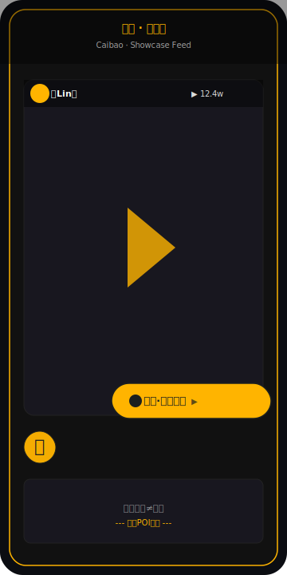
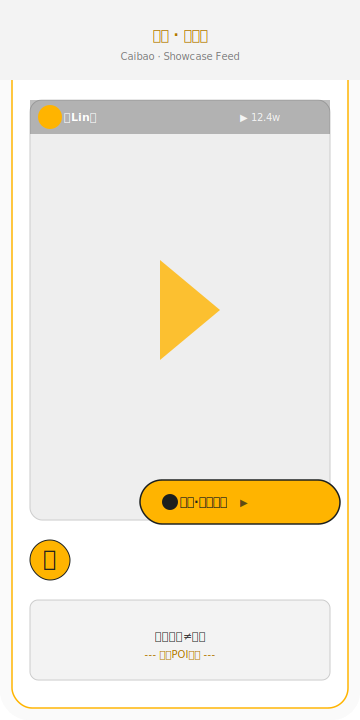
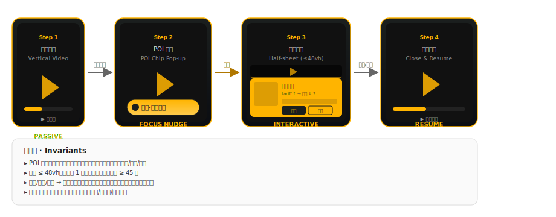
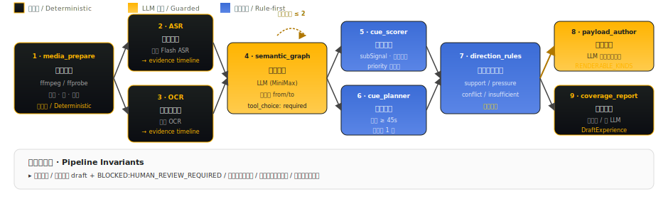
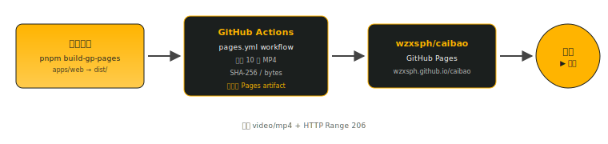

<!-- HERO -->

<div align="center">


# 财包 · 财经推演室
### Caibao · A Lightweight Causal-Reasoning Companion for Finance Video

边看财经视频 · 边做轻量因果推演<br/>
<em>Watch. Pause. Infer. Resume.</em>

[在线预览 Live Demo](https://wzxsph.github.io/caibao/#/home) · [文档 Docs](财经推演室_PRD_V2.7.md) · [架构 ADRs](docs/ADR/)

</div>

---

## 概览 · Overview

<table>
<tr>
<td width="60%" valign="top">

财包是一套「**边看财经视频、边做轻量因果推演**」的移动 Web/PWA 产品。系统在视频关键时间点出现轻量入口；入口曝光时**继续播放**，用户主动点开后才暂停；完成、跳过或关闭后，**按进入前的播放状态恢复**。

本仓库是该产品的**唯一代码源**（前端 + Express 后端 + 生成管线 + 测试），旧 `wzxsph/douyin` 仓仅保留迁移历史与媒体 Release。

> *Caibao is a mobile Web/PWA that turns finance videos into a low-friction causal-reasoning experience. A passive POI surfaces at the right moment, the video keeps playing, and only a deliberate tap pauses the timeline. After complete/skip/close, the player resumes exactly where it left off.*

</td>
<td width="40%" valign="top">

### 内容规模 · Stats

| 指标 / Metric | 数值 / Value |
|---|---|
| 公开推荐视频 Public Showcase | **10** |
| 完整清单 Full Manifest | **25** |
| 触点模板 Cue Templates | **6** |
| 自动触点 Automatic Triggers | **141** |

</td>
</tr>
</table>

### 技术栈 · Tech Stack

| Layer | Stack |
|---|---|
| 前端 Frontend | Vue 3 · TypeScript · Pinia · Vite |
| 后端 Backend | Express · TypeScript |
| 契约 Contracts | Zod |
| LLM Provider | MiniMax (OpenAI-compatible) |
| 语音 ASR | 火山引擎 Flash ASR (Volcengine) |
| 视觉 OCR | 火山引擎 OCR (Volcengine) |
| 媒体 Media | FFmpeg · FFprobe |

---

## 快速预览 · Preview

<table align="center">
<tr>
<td align="center"><br/><sub><b>Dark · 深色主题</b></sub></td>
<td align="center"><br/><sub><b>Light · 浅色主题</b></sub></td>
</tr>
</table>

<div align="center">
<sub>金色「财包·因果推演」胶囊 = POI 轻触点 (CuePill)，可视、可忽略、点击才暂停。右下角「财」FAB = 财包身份标识（与作者头像严格分离）。</sub>
</div>

---

## 交互逻辑（用户视角）· Interaction Flow

<div align="center">



</div>

<div align="center">
<sub>用户视角四步：被动暴露 → 主动点开 → 半屏互动 → 关闭恢复。视频始终是主角，财包不抢占画面。</sub>
</div>

---

## 生成管线架构 · Generation Pipeline

> 离线、有界、规则优先。基于 [ADR-0003](docs/ADR/0003-agentic-generation-pipeline.md)。

<div align="center">



</div>

**触点模板 · Cue Templates (6 类)**：

| ID | 名称 | 中文 | 用途 |
|---|---|---|---|
| `context_card` | Background Card | 背景卡 | 解释当前节点的语境信息 |
| `quick_judgment` | Quick Judgment | 快速判断 | 命题式快问快答 |
| `condition_slider` | Condition Slider | 条件滑杆 | 调节前提观察结果变化 |
| `causal_stitch` | Causal Stitch | 因果拼接 | 拼接因果链上的相邻节点 |
| `counterexample_flip` | Counterexample Flip | 反例翻转 | 翻转命题举反例 |
| `concept_compare` | Concept Compare | 概念辨析 | 区分相邻概念 |

> 详见 [`docs/GENERATION_PIPELINE_DESIGN.md`](docs/GENERATION_PIPELINE_DESIGN.md) 与 [`apps/web/server/src/pipeline/`](apps/web/server/src/pipeline/)

---

## 快速开始 · Quick Start

> 需要 Node.js 20+ · pnpm 10+ · FFmpeg · FFprobe

<table>
<thead>
<tr><th>用途 Purpose</th><th>命令 Command</th><th>说明 Notes</th></tr>
</thead>
<tbody>
<tr><td>安装依赖</td><td><code>corepack pnpm install --frozen-lockfile</code></td><td>锁定依赖版本</td></tr>
<tr><td>前端开发服务</td><td><code>pnpm dev</code></td><td>默认 <code>http://127.0.0.1:3000/</code></td></tr>
<tr><td>API 开发服务</td><td><code>pnpm start:api:minimax</code></td><td>默认 <code>http://127.0.0.1:18787/</code></td></tr>
<tr><td>类型校验</td><td><code>pnpm type-check &amp;&amp; pnpm type-check:server</code></td><td>前端 + 后端</td></tr>
<tr><td>单元/集成测试</td><td><code>pnpm test</code></td><td>Vitest 客户端 + 服务端</td></tr>
<tr><td>端到端测试</td><td><code>pnpm test:e2e</code></td><td>Playwright 关键路径</td></tr>
<tr><td>生产构建</td><td><code>pnpm build</code></td><td>Vite 静态产物</td></tr>
<tr><td>Pages 专用构建</td><td><code>pnpm build-gp-pages</code></td><td>同域媒体校验</td></tr>
<tr><td>依赖审计</td><td><code>pnpm audit --prod</code></td><td>仅生产依赖</td></tr>
<tr><td>媒体生成</td><td><code>pnpm prepare:showcase</code></td><td>媒体派生 + 内容包</td></tr>
</tbody>
</table>

```bash
git clone https://github.com/wzxsph/caibao.git
cd caibao/apps/web
corepack pnpm install --frozen-lockfile
pnpm dev                # 打开 http://127.0.0.1:3000/
```

---

## 配置指南 · Configuration

<details>
<summary><strong>📦 Provider 模式（互斥）</strong> — 点击展开</summary>

| 变量 Var | `.env.minimax` | `.env.doubao` | 说明 |
|---|---|---|---|
| `CAIBAO_PROVIDER` | `minimax` | `doubao` | 选择 LLM provider |
| `CAIBAO_LLM_BASE_URL` | MiniMax OpenAI-compat 端点 | 豆包端点 | 与 provider 配套 |
| `CAIBAO_LLM_API_KEY` | MiniMax 密钥 | 豆包密钥 | **Git-ignored** |
| `CAIBAO_LLM_MODEL` | MiniMax 模型名 | 豆包模型名 | |
| `CAIBAO_ENV_FILE` | `.env.minimax` | `.env.doubao` | 启动时显式加载 |

> 真实密钥只放 Git-ignored 的 `.env.minimax` / `.env.doubao`，**不得**写进 `VITE_*`、提交或日志。

</details>

<details>
<summary><strong>🎙️ ASR（火山引擎 Flash）</strong> — 点击展开</summary>

| 变量 Var | 必填 | 说明 |
|---|---|---|
| `VOLCENGINE_ASR_APP_ID` | ✅ | 火山控制台 App ID |
| `VOLCENGINE_ASR_TOKEN` | ✅ | Access Token（不是 API Key） |
| `VOLCENGINE_ASR_CLUSTER` | ✅ | 集群标识（如 `volcengine_streaming_asr`） |
| `VOLCENGINE_ASR_REGION` | ⬜ | 区域，默认 `cn-north-1` |
| `VOLCENGINE_ASR_TIMEOUT_MS` | ⬜ | HTTP 客户端超时 |

签名走 V4：见 [`volcengine-signature-v4.ts`](apps/web/server/src/providers/volcengine-signature-v4.ts)。

</details>

<details>
<summary><strong>🔍 OCR（火山引擎）</strong> — 点击展开</summary>

| 变量 Var | 必填 | 说明 |
|---|---|---|
| `VOLCENGINE_OCR_ENDPOINT` | ✅ | OCR HTTP 端点 |
| `VOLCENGINE_OCR_AK` | ✅ | Access Key |
| `VOLCENGINE_OCR_SK` | ✅ | Secret Key（Git-ignored） |
| `VOLCENGINE_OCR_TIMEOUT_MS` | ⬜ | 默认 30s |

</details>

<details>
<summary><strong>🛡️ 安全与边界</strong> — 点击展开</summary>

- 不提交 `token` / `Cookie` / `.env*` / 源视频 / 派生视频 / 音轨 / 关键帧 / 模型原始响应
- 不绕过抖音登录、验证码、签名或风控；公开可见 ≠ 可任意下载或再分发
- 模型输出只能形成 Draft/Mock；方向规则、发布状态和报告事实由确定性逻辑控制
- 不保存原始语音，不推断财富状况、风险偏好或投资能力

</details>

---

## 架构决策 · Architecture Decisions

| ADR | 标题 | 状态 | 摘要 |
|---|---|---|---|
| [ADR-0001](docs/ADR/0001-repository-boundary.md) | 保留产品仓与底座代码仓边界 | Superseded | 已被 ADR-0004 取代 |
| [ADR-0002](docs/ADR/0002-content-pipeline-and-publish-gate.md) | 证据优先的离线管线与人工发布门禁 | 已采纳 | 离线解析 · 强制 evidenceId · 人工审核 publish |
| [ADR-0003](docs/ADR/0003-agentic-generation-pipeline.md) | Agentic 生成管线：有界多阶段与规则裁决 | 已采纳 | 单次 LLM → 8 阶段有界管线 |
| [ADR-0004](docs/ADR/0004-caibao-monorepo.md) | 以 caibao 主仓统一维护产品与应用 | 已采纳 | 取代双仓维护，导入基线 `9a461b89` |

---

## 部署 · Deployment

<div align="center">



</div>

- Pages workflow：`.github/workflows/pages.yml`
- 媒体来源：[douyin/releases/tag/showcase-media-20260723-v1](https://github.com/wzxsph/douyin/releases/tag/showcase-media-20260723-v1)
- Pages workflow 运行 #29972348075 已成功；线上实测首条 MP4 `readyState=4`、Range GET 206
- 部署只校验并暂存 `public-video-ids.json` 中的 10 条，**不**把媒体加入 Git

---

## 媒体与权利 · Media & Rights

> ⚠️ 这是参与学习的原型，与抖音及原作者不存在官方隶属关系。

- **完整清单**：`apps/web/media-import/authorized-douyin/download-manifest.json`（Git-ignored）
- **公开集合**：由 `apps/web/src/showcase/public-video-ids.json` 固定 10 条选择
- **派生文件**：25 个 H.264/AAC MP4 + 25 张封面保存在 `showcase-media-20260723-v1` Release
- **运行 assets**：Pages artifact 只包含 10 个 640 长边派生副本，同域 `video/mp4` + HTTP Range 播放
- **权利链**：当前清单窗口截至 **2026-08-22**（Asia/Shanghai）；到期未续期必须下架 Release 并部署**不含媒体**的 Pages artifact
- **不绕过**：登录、验证码、签名或风控均不绕过；公开可见 ≠ 可任意下载或再分发
- **职责声明**：项目未独立完成权利链法律核验，不得把用户声明写成平台或作者官方授权

**财包内容状态**：所有交互文案均为 `internal_poc` / `mock`，**不是**生产审核结论。真实上线仍需：最终 ASR + OCR + 多模态证据时间轴 + 财经人审 + 作者/媒体一致性校验 + 适用于目标环境的分发权利。

---

## 文档地图 · Documentation Map

<table>
<thead>
<tr><th>文档</th><th>路径</th><th>用途</th></tr>
</thead>
<tbody>
<tr><td>Agent 入口</td><td><a href="AGENTS.md"><code>AGENTS.md</code></a></td><td>所有新 Agent 的第一入口</td></tr>
<tr><td>Agent 交接</td><td><a href="docs/AGENT_HANDOFF.md"><code>docs/AGENT_HANDOFF.md</code></a></td><td>代码、部署、测试和下一任务</td></tr>
<tr><td>Agent 运行</td><td><a href="apps/web/RUN_AGENT.md"><code>apps/web/RUN_AGENT.md</code></a></td><td>应用层 Agent 协作流程</td></tr>
<tr><td>PRD V2.7</td><td><a href="财经推演室_PRD_V2.7.md"><code>财经推演室_PRD_V2.7.md</code></a></td><td>最新 Review Candidate</td></tr>
<tr><td>PRD V2.0</td><td><a href="财经推演室_PRD_V2.0.md"><code>财经推演室_PRD_V2.0.md</code></a></td><td>已批准基线</td></tr>
<tr><td>架构总览</td><td><a href="docs/ARCHITECTURE.md"><code>docs/ARCHITECTURE.md</code></a></td><td>系统架构与组件边界</td></tr>
<tr><td>管线架构</td><td><a href="docs/GENERATION_PIPELINE_ARCHITECTURE.md"><code>docs/GENERATION_PIPELINE_ARCHITECTURE.md</code></a></td><td>生成管线结构图</td></tr>
<tr><td>管线设计</td><td><a href="docs/GENERATION_PIPELINE_DESIGN.md"><code>docs/GENERATION_PIPELINE_DESIGN.md</code></a></td><td>8 阶段详细设计</td></tr>
<tr><td>测试计划</td><td><a href="docs/TDD_TEST_PLAN.md"><code>docs/TDD_TEST_PLAN.md</code></a></td><td>TDD 框架与门禁</td></tr>
<tr><td>实施计划</td><td><a href="docs/IMPLEMENTATION_PLAN.md"><code>docs/IMPLEMENTATION_PLAN.md</code></a></td><td>阶段任务与排期</td></tr>
<tr><td>版本治理</td><td><a href="docs/VERSION_GOVERNANCE.md"><code>docs/VERSION_GOVERNANCE.md</code></a></td><td>版本/PRD/标签规则</td></tr>
<tr><td>供应方研究</td><td><a href="docs/RESEARCH_SOURCES_AND_PROVIDERS.md"><code>docs/RESEARCH_SOURCES_AND_PROVIDERS.md</code></a></td><td>Provider 选择与对比</td></tr>
<tr><td>ADR-0001</td><td><a href="docs/ADR/0001-repository-boundary.md"><code>docs/ADR/0001-...</code></a></td><td>仓边界（已取代）</td></tr>
<tr><td>ADR-0002</td><td><a href="docs/ADR/0002-content-pipeline-and-publish-gate.md"><code>docs/ADR/0002-...</code></a></td><td>离线管线 + 人工门禁</td></tr>
<tr><td>ADR-0003</td><td><a href="docs/ADR/0003-agentic-generation-pipeline.md"><code>docs/ADR/0003-...</code></a></td><td>生成管线架构</td></tr>
<tr><td>ADR-0004</td><td><a href="docs/ADR/0004-caibao-monorepo.md"><code>docs/ADR/0004-...</code></a></td><td>主仓统一维护</td></tr>
<tr><td>应用 README</td><td><a href="apps/web/README.md"><code>apps/web/README.md</code></a></td><td>应用层补充</td></tr>
<tr><td>导入来源</td><td><a href="apps/web/IMPORT_PROVENANCE.md"><code>apps/web/IMPORT_PROVENANCE.md</code></a></td><td>旧仓迁移证据</td></tr>
</tbody>
</table>

---

## 贡献 · Contributing

阅读 [**AGENTS.md**](AGENTS.md) 作为第一入口。该文件包含：

- 仓库结构与边界
- 文档单一内容源（Markdown 是 PRD 唯一源）
- 任务拆分与多 Agent 协作惯例
- 提交与版本化规则

应用层 Agent 补充：[**apps/web/RUN_AGENT.md**](apps/web/RUN_AGENT.md)。

---

## 版本历史 · Versions

<table>
<thead>
<tr><th>通道</th><th>提交 / Commit</th><th>站点</th><th>状态</th><th>说明</th></tr>
</thead>
<tbody>
<tr>
<td><strong>Stable</strong></td>
<td><code>d3b197f</code></td>
<td><a href="https://wzxsph.github.io/caibao/#/home">wzxsph.github.io/caibao</a></td>
<td>已发布</td>
<td>推荐流 + 完整 8 阶段管线 + 25 目录 + 6 模板</td>
</tr>
<tr>
<td><strong>Beta</strong></td>
<td><code>c40989e</code></td>
<td><code>?beta=1</code></td>
<td>预览</td>
<td>Stable / Beta 切换器 + POI 链接按钮 + 真实 MiniMax Agent</td>
</tr>
<tr>
<td><strong>Legacy</strong></td>
<td><code>65151c9</code></td>
<td>已退役</td>
<td>迁移跳转</td>
<td>旧 <code>douyin</code> 仓 Pages 退役为跳板</td>
</tr>
</tbody>
</table>

> 用户直接裁决即时覆盖旧文档中的相反条款，但不会自动批准 V2.7 的其他内容。

---

## 许可与致谢 · License & Credits

- 应用代码基于 [zyronon/douyin](https://github.com/zyronon/douyin) 重构，遵循仓库内 [GPL-3.0](LICENSE)
- 视频版权归对应原作者/权利人；项目保留逐条来源链接与作者归属
- 旧仓 `wzxsph/douyin` 仅保留迁移历史与媒体 Release

<div align="center">

<sub>财包 · 边看财经视频 · 边做轻量因果推演 · Made with focus & frugality.</sub>

</div>
