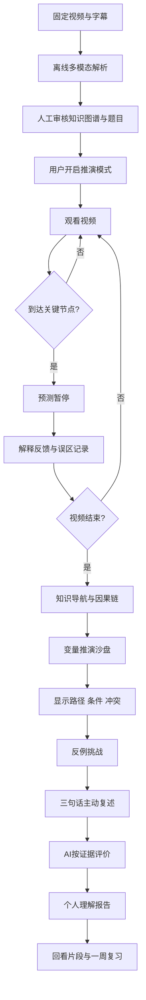

# 《财经推演室》产品需求文档（PRD）

> 不是替用户总结视频，而是让用户亲自运行一遍视频里的逻辑。

## 目录

1. 文档信息与资料依据
2. 产品摘要
3. 项目背景
4. 用户问题
5. 目标用户
6. 产品目标与非目标
7. 产品核心假设
8. 产品定位与竞品差异
9. 核心用户旅程
10. 产品信息架构
11. 完整业务流程
12. 核心页面和交互设计
13. 核心功能需求
14. AI能力设计
15. 结构化数据设计
16. 个性化逻辑
17. 内容安全和风险控制
18. MVP范围
19. 非功能需求
20. 数据指标
21. 实验与验证方案
22. 技术实现建议
23. Demo演示脚本
24. 路演表达
25. 项目路线图
26. 自查结论

## 1. 文档信息与资料依据

| 字段 | 内容 |
|---|---|
| 产品名称 | 财经推演室 |
| 文档版本 | V1.0 |
| 作者 | 王佳一团队 / AI协作稿 |
| 更新时间 | 2026-07-21 |
| 文档状态 | 黑客松评审稿；待原视频与官方完整规则校准 |
| 首版载体 | 抖音精选内容重构概念原型，移动端优先 |
| 首个演示视频 | 《美联储降息如何影响股票、黄金和汇率》（暂定10—20分钟） |

### 1.1 已获取资料

- Workshop截图明确赛道核心命题：当AI可以理解视频内容，内容可以被重新组织、被结构化理解，并转化为帮助用户完成判断和行动的能力；产品应从真实抖音视频出发，让用户真正“看懂、用起来、玩起来”。
- Workshop将探索方向概括为“理解、表达、使用”，分别对应信息层重构、形态层重构和功能层重构。
- 用户提供了完整产品构想、固定财经主题、功能边界及交付要求。

### 1.2 缺失信息

- 比赛完整规则、评分权重、提交格式、可用平台能力和数据合规要求；
- 指定原视频文件、逐字字幕、创作者授权状态和真实时间戳；
- 团队人数、开发工期、既有技术栈和是否必须接入抖音真实播放器；
- 官方财经知识源及比赛提供的模型、语音、视觉接口。

### 1.3 冲突判断与产品假设

当前资料未发现冲突。若后续官方材料与本文冲突，以官方材料为准。本文采用以下可替换假设：

1. **产品假设 H0-1**：首版是一条固定视频的可交互原型，而非开放平台。
2. **产品假设 H0-2**：演示视频已获得比赛演示所需使用权限；真实上线前需完成版权授权。
3. **产品假设 H0-3**：本文时间戳均为演示占位值，须用最终字幕重新对齐，不得宣称为原视频原话。
4. **产品假设 H0-4**：黑客松版允许对AI解析结果进行人工审核与预生成，以保证现场稳定。
5. **产品假设 H0-5**：不接实时行情，不输出价格目标、仓位、交易指令或个性化投资建议。

## 2. 产品摘要

### 2.1 一句话定位

AI将财经科普长视频中的概念、观点、条件与因果关系，重构为可交互的经济推演沙盘，让用户通过预测、调参、反例与复述真正理解财经逻辑。

### 2.2 产品愿景

让优质财经内容不再止于“听过一个结论”，而成为用户能够检验、解释并迁移到新事件中的认知工具。

### 2.3 核心价值主张

| 价值 | 对用户的具体变化 |
|---|---|
| 看懂 | 从线性视频中抽出概念、路径、条件、证据和例外 |
| 想一遍 | 在作者给出答案前先预测，暴露真实认知而非产生“我懂了”的错觉 |
| 跑一遍 | 调整变量，观察多条力量如何同时作用并产生冲突 |
| 讲出来 | 用自己的话还原因果，AI定位漏项、绝对化和概念错误 |
| 用起来 | 面对新情景时不套结论，而会先检查条件和主导变量 |

### 2.4 产品关键词

内容重构、因果推演、主动学习、条件意识、反例校准、迁移理解、原视频可追溯、非投资建议。

## 3. 项目背景

### 3.1 赛题背景与内容重构定义

抖音精选中有大量有信息密度的财经长视频，但典型消费链路仍是“看完—获得启发—继续刷”。内容重构不是为视频加一层摘要，而是让AI理解内容及用户的深层需求，将其重新组织成能够帮助理解、表达、判断或行动的新产品形态。

本项目同时覆盖三层重构：

| Workshop方向 | 财经推演室对应设计 |
|---|---|
| 理解 / 信息层 | 抽取概念、事实/观点/推断、因果、条件、例外与证据 |
| 表达 / 形态层 | 把线性视频变成可点击因果图、变量沙盘、反例卡片 |
| 使用 / 功能层 | 用户完成预测、情景判断、主动复述和迁移应用 |

### 3.2 财经长视频的现有问题

- 结论强、链路长：用户容易记住“降息利好黄金”，却遗漏“实际利率—机会成本—资金偏好”的中间机制。
- 条件隐藏：作者常把通胀、增长、预期差等条件分散在不同段落。
- 多因一果：同一资产同时受利率、盈利、避险、相对政策影响，单一箭头会误导。
- 语言造成错觉：用户能听懂每句话，不等于能独立还原逻辑。
- 缺少迁移：新事件出现时，用户倾向直接套用视频结论。

### 3.3 为什么选择财经科普

财经内容天然包含变量、因果链、条件与反例，适合被重构为推演；同时“结论绝对化”会带来真实认知风险，产品价值容易通过前后测和迁移题验证。边界上，本产品只做知识理解，不做投资决策。

## 4. 用户问题

| 层次 | 问题 |
|---|---|
| 表层 | 视频太长、术语多、看后记不住；不知道哪一段最关键 |
| 深层 | 不能还原因果链；忽略成立条件；把方向性影响当必然结果；不能处理冲突变量 |
| 当前替代方案 | 倍速/收藏、评论区找答案、截图记笔记、AI摘要、思维导图、向通用AI追问、刷选择题 |
| 方案不足 | 摘要继续替用户思考；导图多为并列层级而非有条件因果；题库重识记；通用AI脱离视频证据且难形成连续学习状态 |

核心待解决问题：**如何在不破坏观看体验的前提下，让用户主动运行因果逻辑，并证明自己能在条件变化后正确解释结果？**

## 5. 目标用户

### 5.1 用户画像

| 画像 | 描述 | 核心需求 |
|---|---|---|
| 核心：财经入门型深度内容用户 | 18—30岁，常刷财经科普，无系统经济学训练；会收藏但少复习 | 用低门槛方式真正看懂术语和传导机制 |
| 次级：有基础但易套结论的用户 | 商科学生、职场新人、轻度投资关注者 | 用反例和情景比较补足边界意识 |
| 非目标用户 | 寻找实时行情、个股推荐、确定涨跌预测或专业量化模型的人 | 本产品不满足交易决策需求 |

### 5.2 动机、障碍和场景

- 动机：理解新闻、提升财经谈资、备考/学习、判断科普内容是否可信。
- 障碍：担心学习太重、术语劝退、不愿额外输入长文字、误以为看懂即学会。
- 场景：夜间刷到长视频；收藏后复习；重大宏观事件后回看；课堂外碎片学习。
- 设计应对：观看中最多3次、每次10—20秒轻交互；观看后3分钟完成核心闭环；支持语音复述。

## 6. 产品目标与非目标

### 6.1 目标

| 类型 | V1目标 |
|---|---|
| 产品目标 | 验证“预测+推演+反例+复述”是否比“视频+摘要”更能促进因果理解 |
| 用户目标 | 能解释至少2条传导链；说出至少1个条件和1个反向变量；在新情景中避免机械套结论 |
| 业务目标 | 提升精选长视频的深度互动和有效复习，形成可复用的内容增值形态 |

### 6.2 首版非目标

- 不支持任意视频一键生成，不做创作者后台；
- 不接实时行情，不判断未来真实市场涨跌；
- 不做个股、基金、仓位或买卖建议；
- 不构建完整宏观经济仿真模型；
- 不追求覆盖所有经济学观点，不替代正式课程；
- 不用单一总分定义用户“财经水平”。

## 7. 产品核心假设

| 假设 | 类型 | 验证方式 | 成功信号 |
|---|---|---|---|
| 用户愿意为高价值节点暂停10—20秒 | 用户 | 8—12人可用性测试；观察跳过率 | 3个暂停点平均完成率≥65%，主观打扰≤3/5 |
| 操作变量比阅读摘要更能形成条件意识 | 交互 | 沙盘组 vs 摘要组对照 | 迁移题条件命中率提升≥20个百分点 |
| 固定视频可稳定抽出带证据的因果图 | AI | 专家标注金标逐项核验 | 节点准确率≥95%，关键边准确率≥90% |
| AI能识别“可能→必然”等错误 | AI | 40条人工构造回答测试集 | 错误分类Macro-F1≥0.80；严重概念错召回≥90% |
| 用户理解“推演不是预测” | 风险 | 任务后访谈+选择题 | ≥90%能正确复述边界，无交易建议感知 |
| 报告能推动一次复习 | 用户/业务 | 一周复习提醒实验 | 报告查看者7日复习启动率≥15%（长期目标） |

## 8. 产品定位与竞品差异

| 方案 | 主要输出 | 用户是否先判断 | 是否显式表达条件/反例 | 是否验证迁移 | 财经推演室差异 |
|---|---|---:|---:|---:|---|
| AI视频总结 | 摘要、金句、章节 | 否 | 通常弱 | 否 | 把内容变成需要用户运行的模型 |
| 思维导图 | 层级节点 | 否 | 很少 | 否 | 使用有方向、有条件、可中断的因果边 |
| 在线题库 | 标准答案 | 是 | 偶尔 | 弱 | 反馈认知误区，不止对错 |
| 通用AI问答 | 即时回答 | 可选 | 不稳定 | 无连续状态 | 锚定原视频证据，记录掌握状态并串联任务 |

### 8.1 核心壁垒

不是模型本身，而是四项组合资产：①带时间戳和证据的条件化因果图谱；②财经不确定性表达规范；③从预测、调参到复述的学习闭环；④基于错误类型更新的个人认知状态。黑客松阶段先证明交互闭环，平台化后才积累内容图谱与评测集。

## 9. 核心用户旅程

| 阶段 | 用户行为 | 用户目标 | 情绪 | 痛点 | 产品触点 | AI能力 | 关键指标 |
|---|---|---|---|---|---|---|---|
| 观看前 | 进入视频，看到“开启推演模式” | 判断是否值得投入 | 好奇/谨慎 | 怕学习负担 | 模式说明、预计用时 | 生成主题预告 | 开启率 |
| 观看中 | 正常播放、查看章节 | 跟上论述 | 专注 | 术语与链路分散 | 章节条、概念轻提示 | 字幕对齐、概念识别 | 有效观看时长 |
| 预测 | 在关键点先选下一步 | 检验直觉 | 紧张/好奇 | 不想被考试 | 底部暂停卡 | 题目与误区反馈 | 作答率、跳过率 |
| 知识导航 | 查看核心概念和两条链 | 建立全局结构 | 清晰 | 摘要看完仍被动 | 知识地图 | 图谱呈现、证据定位 | 节点点击率 |
| 推演 | 调整四个变量，运行情景 | 看见条件变化如何改写路径 | 探索 | 多因素相互冲突 | 变量面板、路径区、资产结果区 | 规则计算+解释生成 | 有效运行次数、冲突识别率 |
| 反例 | 判断“降息后股市仍跌” | 理解其他条件不变 | 挑战 | 容易否定整条逻辑 | 反例卡、条件证据 | 错误诊断 | 前提补全率 |
| 复述 | 语音/文字解释黄金链路 | 证明自己会讲 | 认真/不确定 | 不知漏了什么 | 三句话复述框 | 结构化评分 | 因果链完整率、绝对化错误率 |
| 报告/复习 | 查看理解画像、回看片段 | 知道下一步学什么 | 成就/安心 | 分数缺乏行动意义 | 报告、回看和复习卡 | 个性化报告 | 报告查看率、7日复习率 |

## 10. 产品信息架构

```text
财经推演室
├─ 原视频播放
│  ├─ 章节/字幕/概念轻提示
│  └─ 3个预测暂停点
├─ AI知识导航
│  ├─ 5个核心概念
│  └─ 视频证据索引
├─ 因果链
│  ├─ 股票链
│  └─ 黄金链
├─ 变量推演沙盘
│  ├─ 4个变量
│  ├─ 3组预设情景
│  ├─ 传导路径与冲突
│  └─ 股票/黄金/美元的可能方向
├─ 反例挑战
├─ 主动复述
└─ 个人理解报告
   ├─ 掌握状态
   ├─ 错误类型
   ├─ 回看片段
   └─ 迁移与一周复习题
```

## 11. 完整业务流程



解析产线和用户运行时严格分离：固定内容先审核；运行时规则引擎给出方向，语言模型只基于规则输出与视频证据解释。

## 12. 核心页面和交互设计

### 12.1 原视频播放页

| 项目 | 设计 |
|---|---|
| 页面目标 | 保留原视频主体验，让AI互动成为轻量辅助入口 |
| 页面模块 | 播放器、章节进度条、“推演模式”开关、概念浮签、底部知识入口 |
| 页面内容 | 标题、时长、当前章节；“全程约多3分钟，含3次预测” |
| 交互 | 默认提示一次是否开启；开启后在时间点触发暂停；用户可关闭或稍后学习 |
| 按钮文案 | “开启推演模式”“先看视频”“查看这段逻辑” |
| 状态变化 | 未开启→已开启→预测中→继续播放→视频完成 |
| 异常 | 字幕失败则隐藏即时概念提示，保留预置时间点；网络失败保存进度并重试 |
| 上下游 | 上游视频详情；下游预测弹层或知识导航 |

### 12.2 AI知识导航页

| 项目 | 设计 |
|---|---|
| 页面目标 | 用一屏回答“这条视频要理解哪5件事” |
| 模块 | 章节时间轴、5个概念卡、事实/观点/推断标签、2条核心链入口 |
| 内容 | 联邦基金利率、融资成本、股票估值、黄金机会成本、相对利差；每项含一句解释和时间戳 |
| 交互 | 点概念展开定义；点时间戳回到片段；长按收藏待复习 |
| 按钮 | “看原片 03:20”“运行这条逻辑”“我没看懂” |
| 状态 | 未读/已查看/需复习/已掌握 |
| 异常 | 无可靠证据的卡片不展示；提示“原视频未明确说明” |
| 关系 | 从播放页进入；可到因果链或回看视频 |

### 12.3 因果链页面

| 项目 | 设计 |
|---|---|
| 页面目标 | 展现“结论中间发生了什么、何时会断” |
| 模块 | 横向节点链、关系箭头、条件抽屉、反向变量、证据片段、AI追问 |
| 内容 | 股票链与黄金链；所有结果节点写“可能” |
| 交互 | 点节点解释；点箭头看关系；点“如果不是呢”高亮中断因素；点时间戳播放片段 |
| 按钮 | “看成立条件”“哪些因素会打断？”“回到原片”“问AI” |
| 状态 | 默认路径→选中节点→条件层→反例层 |
| 异常 | 关系存在争议时显示“视频观点/补充解释”及置信层级，不画成确定事实 |
| 关系 | 知识导航进入；可直接带着该链进入沙盘 |

两条MVP链：

1. 利率下降 → 企业融资成本通常下降 → 利润/现金流预期可能改善，且折现率可能下降 → 股票估值获得支撑。条件：信用传导正常、盈利未大幅恶化、降息不显著低于预期。打断变量：衰退冲击、风险溢价上升、已提前计价。
2. 利率下降 → 美元利率回报通常下降 → 持有无息黄金的机会成本下降 → 黄金需求可能增加 → 金价可能获支撑。条件：实际利率确实下降、美元未因相对政策走强。打断变量：通胀更快下降、流动性抛售、其他经济体降息更多。

### 12.4 预测暂停弹层

| 项目 | 设计 |
|---|---|
| 页面目标 | 在答案出现前采集用户真实预测，制造适度认知冲突 |
| 模块 | 情景句、问题、3个选项、“不确定”、回答后反馈卡 |
| 交互 | 单选后提交；反馈先复述选择，再显示路径、条件和误区；可跳过 |
| 按钮 | “确认判断”“我不确定”“继续看答案”“回看10秒” |
| 状态 | 未答→已选→反馈→继续；跳过也记录但不惩罚 |
| 异常 | 超过20秒无操作显示“先继续看”；不自动判用户财经水平 |
| 关系 | 覆盖播放页，不跳页；反馈后回原进度 |

三个暂停点：

| 点位 | 占位时间 | 题目 | 主要误区 |
|---|---:|---|---|
| P1 | 03:20 | 利率回报下降后，美元资产吸引力通常如何变化？ | 把美元和美股混为一谈 |
| P2 | 07:10 | 降息是否一定推高黄金？ | 把可能当必然、忽略实际利率 |
| P3 | 11:40 | 衰退式降息时，股市下一步一定上涨吗？ | 忽略盈利与风险溢价 |

反馈不能只有正误，因为同一选项可能由不同理由得到。反馈结构固定为：**你的判断 → 合理部分 → 缺失条件 → 原视频证据 → 换一个条件会怎样**。

### 12.5 变量推演沙盘

| 项目 | 设计 |
|---|---|
| 页面目标 | 让用户操作条件，观察多条路径的合力与冲突 |
| 模块 | 变量控制区、运行按钮、传导路径区、资产影响卡、短期/中长期切换、主导变量解释、免责声明 |
| 内容 | 利率、通胀、增长、避险情绪；股票、黄金、美元只给方向区间（支撑/压制/方向不明） |
| 交互 | 单选/分段滑块调整；改变后需点“运行推演”；可加载A/B/C预设；点冲突标签查看两股力量 |
| 按钮 | “运行这组条件”“载入情景A”“查看冲突”“为什么？”“重置” |
| 状态 | 初始→变量已改未运行→计算中→结果→继续调整 |
| 异常 | 规则不足时输出“方向不明，需要更多变量”，不让模型补猜；非法组合提示修正 |
| 关系 | 因果链进入；完成一次后解锁反例挑战 |

#### 三组完整推演案例

| 案例 | 输入 | 主要因果路径 | 可能结果 | 成立条件 | 冲突因素 | 应掌握知识点 |
|---|---|---|---|---|---|---|
| A 温和降息 | 利率下降；通胀下降；增长稳定；避险低 | 折现率↓、融资成本↓；实际利率可能↓；美元收益吸引力↓ | 股票通常获支撑；黄金可能获支撑；美元可能偏弱 | 降息符合/略超预期，增长与盈利稳定 | 通胀降得比名义利率更快会令实际利率不降；市场已提前计价 | 降息影响要经过折现率、盈利、实际利率和预期差 |
| B 衰退式降息 | 利率下降；通胀下降/低；增长衰退；避险高 | 利率利好估值，但衰退压低盈利、风险溢价上升；避险支持黄金与部分美元需求 | 股票短期仍可能下跌；黄金可能受支撑但有波动；美元方向可能冲突 | 衰退冲击强于政策缓冲；金融体系无极端流动性抛售 | 强美元避险与降息压美元相冲突；现金荒可短期压黄金 | 降息原因比降息动作本身重要，多条路径可方向相反 |
| C 相对降息 | 美国利率下降；通胀中性；增长稳定；避险低；其他经济体降息幅度更大 | 美国绝对收益率降，但相对利差可能扩大或少缩 | 美元未必走弱，甚至可能偏强；黄金的美元渠道受压，利率渠道仍可能支撑；股票偏中性/获支撑 | 资本流动对相对利差敏感，其他因素稳定 | 美国数据转弱、风险偏好变化会改写方向 | 汇率看相对政策，不只看美国利率绝对变化 |

主导变量显示规则：比较所有激活路径的规则权重和证据强度；若前两项接近，显示“主导力量未决”，而非强行选一个。

### 12.6 反例挑战页面

| 项目 | 设计 |
|---|---|
| 页面目标 | 修正“一个反例推翻机制”或“一条机制解释一切”的误区 |
| 内容 | “美联储降息后，股票市场仍然下跌。这是否说明视频中的逻辑错误？” |
| 回答方式 | 选择“说明错误/不一定/信息不足”，再从增长、盈利、预期差、风险溢价中选理由，可补充文字 |
| 反馈 | 指出机制是条件性影响；展示“利率支撑估值”与“衰退压低盈利”两条并行路径；要求用户补全条件 |
| 按钮 | “提交判断”“加入一个条件”“看两股力量”“回看原片” |
| 状态 | 初答→追问条件→二次回答→解释完成 |
| 异常 | 用户输入交易问题时切换知识解释与风险提示，不给操作建议 |
| 关系 | 沙盘后进入；完成后到主动复述 |

反例生成约束：必须从已审核图谱中选择“目标结论+至少一个反向路径+缺失条件”；不凭空编造真实市场日期或数据。复杂现象至少展示两条竞争机制，并用“在其他条件不变时”解释局部因果效应。

### 12.7 主动复述页面

| 项目 | 设计 |
|---|---|
| 页面目标 | 用生成效应检验理解，而非让用户识别现成答案 |
| 内容 | “请用三句话向没学过财经的朋友解释：为什么降息可能影响黄金价格？” |
| 交互 | 文字或语音输入；提交后按7维反馈；可按提示改写一次 |
| 按钮 | “开始说”“提交复述”“给我一个提示”“重新表达” |
| 状态 | 未作答→转写/输入→分析→反馈→改写 |
| 异常 | 转写置信度低时要求确认文本；过短先提示补充，不直接低分 |
| 关系 | 反例后进入；结果写入报告 |

示例用户回答：

> 美联储一降息，美元就会贬值，所以大家一定会买黄金，黄金价格就会上涨。

AI反馈：

- 核心方向提到了：降息可能通过美元/持有成本影响黄金。
- 缺少关键中间环节：黄金通常不生息；当实际利率下降时，持有黄金相对生息资产的机会成本可能下降。
- “美元一定贬值”“黄金一定上涨”过度确定。汇率还取决于其他经济体政策、增长和避险需求。
- 当前把先后变化直接连成必然因果，建议明确机制与条件。
- 建议补充：名义利率下降是否带来实际利率下降，以及市场是否已提前预期。

改进回答：

> 美联储降息通常会降低美元生息资产的回报；如果通胀没有下降得更快，实际利率也可能下降。由于黄金本身不生息，持有黄金相对债券等资产的机会成本可能降低，从而给黄金需求和价格带来支撑。但这不是必然结果，美元相对强弱、避险情绪和市场是否已提前计价也会影响最终表现。

### 12.8 个人理解报告页面

| 项目 | 设计 |
|---|---|
| 页面目标 | 形成可行动的“理解画像”，而不是只给总分 |
| 模块 | 一句话画像、概念掌握、因果链、条件意识、错误模式、能解释的问题、迁移题、一周复习、回看片段 |
| 内容 | 例：“你已掌握黄金机会成本链，但容易把汇率方向说成必然；建议回看07:10—08:05” |
| 交互 | 展开证据、回看片段、立即做迁移题、设置一周复习 |
| 按钮 | “回看关键片段”“挑战新情景”“一周后复习” |
| 状态 | 生成中→初版→完成改写后更新 |
| 异常 | 证据不足则显示“尚未观察到”，不推断人格、风险偏好或投资能力 |
| 关系 | 终点；可回流视频、沙盘和复习题 |

## 13. 核心功能需求

| 编号 | 模块 | 用户故事 | 功能描述 | 前置条件 | 主流程 | 异常流程 | 输入 | 输出 | 优先级 | 验收标准 |
|---|---|---|---|---|---|---|---|---|---|---|
| F-01 | 视频解析 | 作为编辑，我要把固定视频变成可信知识结构 | 解析字幕、音频、关键帧并产出带证据图谱 | 有视频与字幕 | 转写→分章→抽取→对齐→审核 | 低置信项进入人工队列 | 视频、字幕 | JSON图谱 | P0 | 5概念、2链、条件/例外均可追溯；关键边人工通过率100% |
| F-02 | 播放/章节 | 作为用户，我要边看边知道结构 | 播放与章节进度同步 | 内容已发布 | 播放→进度更新→章节提示 | 加载失败保留进度 | 播放位置 | 章节状态 | P0 | 时间点偏差≤1秒；断网恢复不丢进度 |
| F-03 | 预测暂停 | 我想在答案前检验直觉 | 3个低打扰预测点与解释反馈 | 开启推演模式 | 暂停→选答→反馈→续播 | 可跳过/超时续播 | 选择与理由 | 误区标签 | P0 | 每题≤20秒；续播位置准确；反馈含条件而非仅正误 |
| F-04 | 知识导航 | 我想快速看见视频骨架 | 章节、概念、证据索引 | 解析通过 | 浏览→点卡→回片 | 无证据项不发布 | knowledge JSON | 卡片列表 | P1 | 5概念均有定义、时间戳、来源类型 |
| F-05 | 因果链 | 我想知道结论中间怎么发生 | 可点击节点、边、条件和打断变量 | 图谱通过审核 | 选链→点节点→看证据 | 争议边显示限定 | graph JSON | 交互图 | P0 | 2链完整；每条边至少1条件或1限制；结果用审慎语言 |
| F-06 | 沙盘 | 我想改变条件看结果如何变化 | 四变量规则推演、短中期、冲突和主导因素 | 规则表已配置 | 设变量→运行→路径→结果 | 无规则则方向不明 | 变量枚举 | 路径与资产影响 | P0 | A/B/C结果与金标一致；相同输入结果确定；不出现买卖建议 |
| F-07 | 反例 | 我想知道为何降息后股票仍跌 | 一题两阶段条件补全 | 完成一次推演 | 判断→补条件→反馈 | 自由输入越界则安全回复 | 选项/文本 | 错误类型 | P0 | 能区分机制错误与条件变化；至少显示2条竞争路径 |
| F-08 | 主动复述 | 我想确认自己是否真会解释 | 文字/语音复述与7维评价 | 完成反例 | 输入→分析→反馈→改写 | 转写低置信时确认 | 文本 | 维度反馈 | P0 | 反馈引用缺失节点；能识别“必然化”；不编造用户未说内容 |
| F-09 | 理解报告 | 我想知道掌握与下一步 | 汇总行为证据，生成画像、迁移和复习任务 | 有至少一次作答 | 聚合→生成→展示 | 数据不足标注未观察 | 全流程事件 | report JSON | P0 | 包含9类指定内容；推荐片段与错误证据对应 |
| F-10 | AI追问 | 我想追问某节点 | 基于当前节点和视频证据回答 | 已选节点 | 提问→检索→回答 | 超范围明确说明 | 问题+节点 | 引证回答 | P1 | 回答含时间戳；无法证实时不猜测 |
| F-11 | 复习 | 我想一周后再检验 | 生成延迟复习问题 | 报告完成 | 设置→提醒→作答 | 无提醒能力则生成卡片 | 掌握状态 | 复习题 | P2 | 题目针对最弱错误类型 |

## 14. AI能力设计

### 14.1 解析输出要求

AI从视频、字幕、音频和关键帧提取：主题、章节、核心概念、观点、事实、推断、因果边、成立条件、例外、案例、数据、论据及时间戳。每个原子结论必须包含来源类型、证据片段、时间范围、置信度和审核状态。

### 14.2 能力分工

| 能力 | 预处理 | 大语言/多模态模型 | 规则引擎/程序 | 人工审核 |
|---|---|---|---|---|
| 视频理解 | 抽音轨、关键帧、ASR、切段 | 分章、主题与案例识别 | 合并时间段、格式校验 | 核心章节 |
| 字幕对齐 | ASR词级时间戳 | 修复断句与指代 | 动态对齐/时间偏差检查 | 关键证据 |
| 概念提取 | 去噪、术语词典 | 定义与通俗解释 | 去重、ID映射 | 5个概念 |
| 因果/条件/例外 | 候选句检索 | 生成候选节点与边 | 图无环检查、枚举校验 | 所有P0边 |
| 题目生成 | 选择关键边 | 生成题干、干扰项和误区解释 | 频率、长度、答案结构 | 3道题 |
| 情景推演 | 配置规则表 | 把确定路径解释成人话 | **负责方向计算、冲突和主导候选** | A/B/C金标 |
| 回答评价 | ASR/文本规范化 | 语义覆盖、概念错诊断 | 关键词图匹配、绝对词检测 | 测试集抽检 |
| 学习报告 | 事件聚合 | 生成易读反馈和题目 | 掌握度更新、片段推荐 | 模板审核 |

### 14.3 降低幻觉与财经不确定性

1. **证据优先**：涉及“视频说了什么”的结论只能来自字幕/画面证据，并标时间戳；外部补充必须显式标“AI补充”，MVP默认关闭。
2. **图谱约束**：模型只能从审核通过的节点、边和变量枚举生成解释；禁止自由生成新资产或新数据。
3. **计算与表达分离**：规则引擎计算方向、冲突、时间维度；模型不决定涨跌。
4. **不确定性词表**：资产影响只允许“可能获得支撑/可能承压/方向冲突/信息不足”；禁止“一定、必然、稳赚”。
5. **预期差提醒**：展示政策变化时强制检查“是否已被市场预期”。
6. **相对性提醒**：展示美元时强制检查“其他经济体政策”。
7. **拒答边界**：出现“买什么、何时买、仓位、目标价”时，拒绝个性化建议并转为机制解释。
8. **原视频偏见隔离**：区分“视频明确事实”“作者观点”“AI推断”，不把创作者观点升级为事实。

## 15. 结构化数据设计

以下为可直接供前后端联调的合并示例（MVP可拆成多张表/集合）：

```json
{
  "video": {
    "video_id": "fed_rate_demo_001",
    "title": "美联储降息如何影响股票、黄金和汇率",
    "duration_sec": 900,
    "status": "human_reviewed",
    "disclaimer": "仅用于财经知识学习，不构成投资建议。",
    "chapters": [
      {"id": "ch1", "title": "利率是什么", "start_ms": 0, "end_ms": 185000},
      {"id": "ch2", "title": "股票传导链", "start_ms": 185000, "end_ms": 425000},
      {"id": "ch3", "title": "黄金与美元", "start_ms": 425000, "end_ms": 690000},
      {"id": "ch4", "title": "条件与反例", "start_ms": 690000, "end_ms": 900000}
    ]
  },
  "concepts": [
    {
      "id": "c_fed_rate",
      "name": "美联储政策利率",
      "plain_definition": "美联储影响短期美元资金成本的重要政策工具。",
      "source_type": "video_claim",
      "evidence": {"start_ms": 42000, "end_ms": 72000, "transcript": "[待最终字幕替换]"},
      "confidence": 0.97,
      "review_status": "approved"
    },
    {"id": "c_financing", "name": "融资成本", "plain_definition": "企业借入资金需要承担的成本。", "source_type": "video_claim", "evidence": {"start_ms": 205000, "end_ms": 228000, "transcript": "[待最终字幕替换]"}, "confidence": 0.95, "review_status": "approved"},
    {"id": "c_valuation", "name": "股票估值", "plain_definition": "市场对企业未来现金流折算到今天的定价。", "source_type": "video_claim", "evidence": {"start_ms": 270000, "end_ms": 318000, "transcript": "[待最终字幕替换]"}, "confidence": 0.94, "review_status": "approved"},
    {"id": "c_opportunity_cost", "name": "黄金机会成本", "plain_definition": "持有不生息黄金时放弃的生息资产回报。", "source_type": "video_claim", "evidence": {"start_ms": 470000, "end_ms": 520000, "transcript": "[待最终字幕替换]"}, "confidence": 0.96, "review_status": "approved"},
    {"id": "c_relative_rate", "name": "相对利差", "plain_definition": "美国与其他经济体利率回报的差异。", "source_type": "video_claim", "evidence": {"start_ms": 610000, "end_ms": 650000, "transcript": "[待最终字幕替换]"}, "confidence": 0.91, "review_status": "approved"}
  ],
  "causal_graph": {
    "nodes": [
      {"id": "n_rate_down", "label": "美联储利率下降", "type": "policy", "concept_id": "c_fed_rate"},
      {"id": "n_cost_down", "label": "企业融资成本通常下降", "type": "mechanism", "concept_id": "c_financing"},
      {"id": "n_valuation_support", "label": "股票估值可能获支撑", "type": "outcome", "concept_id": "c_valuation"},
      {"id": "n_usd_yield_down", "label": "美元生息资产回报通常下降", "type": "mechanism", "concept_id": "c_relative_rate"},
      {"id": "n_gold_cost_down", "label": "黄金机会成本可能下降", "type": "mechanism", "concept_id": "c_opportunity_cost"},
      {"id": "n_gold_support", "label": "黄金价格可能获支撑", "type": "outcome", "concept_id": "c_opportunity_cost"}
    ],
    "edges": [
      {
        "id": "e1",
        "from": "n_rate_down",
        "to": "n_cost_down",
        "relation": "may_cause",
        "explanation": "政策利率下降通常会降低部分市场融资成本。",
        "conditions": ["信用传导正常", "风险溢价未显著上升"],
        "breakers": ["银行惜贷", "信用风险骤升"],
        "evidence": {"start_ms": 205000, "end_ms": 245000},
        "confidence": 0.91,
        "review_status": "approved"
      },
      {
        "id": "e2",
        "from": "n_cost_down",
        "to": "n_valuation_support",
        "relation": "supports",
        "conditions": ["盈利预期没有大幅恶化", "降息未完全提前计价"],
        "breakers": ["衰退压低盈利", "风险溢价上升"],
        "evidence": {"start_ms": 270000, "end_ms": 340000},
        "confidence": 0.88,
        "review_status": "approved"
      },
      {
        "id": "e3",
        "from": "n_rate_down",
        "to": "n_usd_yield_down",
        "relation": "usually_causes",
        "conditions": ["其他经济体政策不发生更大变化"],
        "breakers": ["其他经济体降息幅度更大"],
        "evidence": {"start_ms": 430000, "end_ms": 475000},
        "confidence": 0.9,
        "review_status": "approved"
      },
      {
        "id": "e4",
        "from": "n_usd_yield_down",
        "to": "n_gold_cost_down",
        "relation": "may_cause",
        "conditions": ["实际利率同步下降"],
        "breakers": ["通胀下降速度快于名义利率"],
        "evidence": {"start_ms": 475000, "end_ms": 535000},
        "confidence": 0.89,
        "review_status": "approved"
      },
      {
        "id": "e5",
        "from": "n_gold_cost_down",
        "to": "n_gold_support",
        "relation": "supports",
        "conditions": ["其他黄金需求因素没有明显反向变化"],
        "breakers": ["流动性抛售", "美元因相对利差走强"],
        "evidence": {"start_ms": 535000, "end_ms": 590000},
        "confidence": 0.86,
        "review_status": "approved"
      }
    ]
  },
  "prediction_pause": {
    "id": "pp_02",
    "trigger_ms": 430000,
    "question": "美联储宣布降息，美元生息资产回报下降。下一步更可能发生什么？",
    "options": [
      {"id": "a", "text": "持有黄金的机会成本可能下降", "misconception": null},
      {"id": "b", "text": "黄金价格必然上涨", "misconception": "possibility_as_certainty"},
      {"id": "c", "text": "企业盈利必然下降", "misconception": "unrelated_chain"},
      {"id": "u", "text": "我不确定", "misconception": "knowledge_gap"}
    ],
    "best_option_id": "a",
    "feedback_template": {"mechanism": "黄金不生息，生息资产回报下降时其相对机会成本可能降低。", "condition": "需关注实际利率和美元相对强弱。", "video_range_ms": [430000, 535000]}
  },
  "sandbox": {
    "variables": [
      {"id": "fed_rate", "label": "美联储利率", "type": "enum", "values": ["up", "down", "same"], "default": "same"},
      {"id": "inflation", "label": "通胀", "type": "enum", "values": ["high", "low", "rising", "falling"], "default": "low"},
      {"id": "growth", "label": "经济增长", "type": "enum", "values": ["strong", "stable", "weak", "recession"], "default": "stable"},
      {"id": "risk_aversion", "label": "避险情绪", "type": "enum", "values": ["high", "low"], "default": "low"}
    ],
    "scenario_output": {
      "scenario_id": "B",
      "activated_paths": ["rate_to_valuation_positive", "recession_to_earnings_negative", "risk_to_gold_positive"],
      "asset_impacts": [
        {"asset": "stocks", "short_term": "pressure", "medium_term": "uncertain", "conflict": true},
        {"asset": "gold", "short_term": "support", "medium_term": "support_or_uncertain", "conflict": false},
        {"asset": "usd", "short_term": "conflicting", "medium_term": "uncertain", "conflict": true}
      ],
      "dominant_factor": {"status": "candidate", "label": "衰退导致的盈利下修", "reason_rule_ids": ["r_growth_earnings_01"]},
      "boundary": "情景推演，不构成投资建议或市场预测。"
    }
  },
  "retelling_score": {
    "response_id": "rsp_1001",
    "dimensions": {
      "core_conclusion": {"level": "partial", "evidence": "提到黄金上涨"},
      "intermediate_causes": {"level": "missing", "missing_nodes": ["实际利率", "机会成本"]},
      "causality": {"level": "risk", "issue": "把美元变化直接等同于黄金上涨"},
      "uncertainty": {"level": "incorrect", "trigger": "一定"},
      "conditions": {"level": "missing", "missing": ["通胀变化", "相对利差"]},
      "concept_accuracy": {"level": "partial", "errors": []},
      "clarity": {"level": "good", "note": "易懂但过度简化"}
    },
    "error_tags": ["possibility_as_certainty", "missing_mechanism", "missing_condition"],
    "recommended_clip": {"start_ms": 475000, "end_ms": 535000}
  },
  "learning_report": {
    "user_session_id": "sess_demo_01",
    "understanding_profile": "已理解利率与资产回报的基本方向，但需要加强实际利率、相对利差和条件性表达。",
    "mastered_concepts": ["美联储政策利率", "融资成本"],
    "mastered_chains": ["股票估值链：partial", "黄金机会成本链：partial"],
    "confusions": ["名义利率与实际利率", "绝对利率与相对利差"],
    "biases": ["把可能当必然", "单一原因解释复杂结果"],
    "can_explain": ["降息为何可能降低融资成本"],
    "transfer_question": "若美国降息但欧洲降息更多，美元是否一定走弱？请说明条件。",
    "review_question_7d": "请不看提示还原降息影响黄金的三步因果链，并说出一个打断因素。",
    "recommended_clips": [{"start_ms": 475000, "end_ms": 535000, "reason": "补足机会成本中间环节"}],
    "understanding_level": {"label": "机制初步掌握，边界意识待加强", "not_a_score": true}
  }
}
```

## 16. 个性化逻辑

### 16.1 错误类型识别

| 标签 | 触发信号 | 反馈策略 |
|---|---|---|
| knowledge_gap | 选“不确定”或缺核心概念 | 给一级通俗解释+回看片段 |
| missing_mechanism | 只说起点和终点 | 要求补一个中间节点，显示节点槽位 |
| missing_condition | 未提条件 | 用“如果增长快速恶化呢？”追问 |
| possibility_as_certainty | 出现一定/必然/肯定且无限定 | 高亮绝对词，要求改写为条件句 |
| correlation_as_causation | 只有同时发生，无机制 | 询问“中间通过什么发生？” |
| single_cause_bias | 用单一变量解释最终市场表现 | 展示竞争路径并要求选主导候选 |
| concept_confusion | 混淆名义/实际利率、美元/美元资产 | 给对比卡和对应片段 |

### 16.2 难度与解释层级

- 连续2次正确且理由完整：下一题隐藏选项，改为排序因果节点或开放回答。
- 正确但理由缺条件：保持难度，追加条件追问。
- 错误或“不确定”：先给“生活类比”一级解释；再次错误再展开专业定义与原片。
- 解释分三级：一句话类比 → 三步机制 → 条件、例外与竞争路径。

### 16.3 掌握状态

每个概念/因果边维护 `unseen / exposed / recognized / explained / transferred / needs_review`。选择题正确最多到 `recognized`；主动复述覆盖路径到 `explained`；迁移题在新条件下正确才到 `transferred`。推荐片段按“错误标签→缺失节点→节点证据时间戳”确定，不由模型自由推荐。

## 17. 内容安全和风险控制

| 风险 | 具体表现 | 解决方案 | 验收/监控 |
|---|---|---|---|
| 财经事实错误 | 定义或传导机制错误 | 专家/编辑审核P0知识图谱；保留证据与版本 | 发布前关键项100%审核 |
| 模型幻觉 | 编造视频观点、数据或时间戳 | 受限检索、结构化输出、无证据不展示 | 幻觉率<2%，关键结论0容忍 |
| 被理解为投资建议 | 用户据此交易 | 全局免责声明；禁交易词模板；不接个性风险画像 | 红队问题100%拒绝建议 |
| 原视频观点偏见 | 作者观点被当事实 | 事实/观点/推断三标签；展示“视频观点” | 所有观点标签完整 |
| 过度简化 | 一条链解释市场 | 每个结果展示条件和打断项；冲突时不强判 | 资产结果至少含1项限制 |
| 内容时效性 | 旧政策环境被当当前事实 | 显示视频发布日期和知识审核日期；不接实时结论 | 过期内容提示可见 |
| 用户隐私 | 语音、作答形成敏感画像 | 最小化采集；语音转文字后可删除音频；不推断财富/风险偏好 | 支持删除记录；权限说明 |
| 版权与引用 | 长片段或字幕再分发 | 获取授权；只播放必要短片段；保留创作者入口与署名 | 权利状态为approved才发布 |

## 18. MVP范围

首版**只支持一条固定视频**《美联储降息如何影响股票、黄金和汇率》。最低内容量：5个概念、2条因果链、3个预测点、4个变量、3组预设情景、1个反例、1次复述、1份报告。

| 层级 | 范围 | 实现策略 |
|---|---|---|
| P0 黑客松必须 | 固定视频播放；3预测点；2条可点因果链；四变量和A/B/C情景；1反例；文字复述；理解报告；风险提示 | 数据预生成+人工审核；规则表驱动；AI仅做受限反馈 |
| P1 演示增强 | 知识导航、节点追问、语音输入、短/中期切换、自定义变量组合、动画路径 | 视工期逐项开启；均有静态兜底 |
| P2 未来 | 任意视频解析、创作者编辑台、多视频知识连接、间隔复习、用户长期知识图谱、更多财经主题 | 需版权、专家审核与规模化评测后推进 |

黑客松成功不以“自动解析所有视频”为标准，而以现场完整跑通一条内容重构闭环、回答为何比摘要更有效为标准。

## 19. 非功能需求

| 类别 | 要求 |
|---|---|
| 加载 | 首屏骨架≤1秒，Wi-Fi下可交互≤2.5秒；视频沿用缓存/预加载 |
| AI等待 | 预测反馈≤1秒（模板）；沙盘≤1.5秒（规则）；复述反馈P95≤8秒；报告P95≤10秒 |
| 准确性 | P0知识与规则100%人工审核；复述严重概念错召回≥90% |
| 可解释性 | 每条关键结论含路径、条件/限制和视频证据；显示规则版本 |
| 可用性 | 单手操作；触控目标≥44px；一次主任务≤5分钟；允许跳过 |
| 移动端 | 设计基准375×812；因果图可横滑但主链一屏显示3节点；字号≥14px |
| 无障碍 | 字幕、色彩非唯一编码、语音可改文字、动画可关闭 |
| 兜底 | AI失败使用预置反馈；沙盘失败回预设情景；报告失败给结构化模板 |
| 稳定性 | Demo核心路径成功率≥99%；现场准备录屏备份但优先真机演示 |

## 20. 数据指标

### 20.1 北极星指标

**有效理解完成率（EUC）**：开启推演模式的用户中，同时满足“完成至少1次沙盘、复述覆盖关键链≥70%、迁移题正确且未出现必然化错误”的用户比例。

该指标把行为与学习结果绑定，避免用点击或流程完成冒充理解。

### 20.2 指标体系

| 类别 | 指标 | 定义/关注点 |
|---|---|---|
| 观看 | 推演模式开启率、预测点到达率、暂停跳过率、续播率 | 互动是否打断观看 |
| 互动 | 每人有效推演次数、变量改动数、条件/冲突展开率、反例二次作答率 | 用户是否真的探索 |
| 学习 | 因果节点复述覆盖率、条件命中率、迁移题正确率、7日延迟复述率 | 是否理解并迁移 |
| 偏差 | “可能→必然”错误率、单一原因错误率、相关/因果混淆率 | 前后测下降幅度 |
| AI质量 | 图谱准确率、证据命中率、错误分类F1、拒答正确率、无依据生成率 | 可信与安全 |
| 留存 | 报告查看率、片段回看率、7日复习启动/完成率、同类内容再次开启率 | 能否形成习惯 |

事件最小集：`mode_opened`、`pause_answered`、`pause_skipped`、`node_opened`、`scenario_run`、`conflict_viewed`、`counterexample_answered`、`retelling_submitted`、`report_viewed`、`clip_replayed`、`transfer_answered`。

## 21. 实验与验证方案

### 21.1 用户访谈与可用性测试

- 访谈8—12名目标用户，先让其自然看视频并复述，再使用原型。
- 观察是否理解“变量控制”“方向冲突”“主导候选”；记录每个卡点而非只问喜好。
- 测试任务：找到黄金链条件、运行B场景、解释为何股票仍跌、完成三句话复述。
- 通过线：≥80%无需帮助完成核心流程；≥70%能正确解释“降息不等于股市必涨”。

### 21.2 对照实验

随机分两组：A为原视频+AI摘要，B为原视频+财经推演室。控制总学习时间尽量一致。前测后测使用不同表述但同构题：

1. 机制还原题：排序/补全黄金因果链；
2. 条件识别题：列出一个使结论不成立的变量；
3. 迁移题：美国降息、欧洲降息更多时判断美元；
4. 表达题：检查“必然”语言；
5. 延迟题：一周后无提示复述。

主要判据：B组迁移题和条件识别显著优于A组，且观看满意度不明显下降。沙盘有效性通过“运行次数”与“迁移提升”相关性、操作录像和访谈解释共同判断，不能只看点击。

### 21.3 A/B方向

- 预测暂停2次 vs 3次：比较打扰感与迁移效果；
- 自动弹出 vs 用户轻触展开：比较完成率和续播率；
- 先显示资产结果 vs 先显示路径：验证是否诱导只看结论；
- 数字总分 vs 理解画像：比较报告理解和后续行动。默认不展示总分。

## 22. 技术实现建议

### 22.1 建议架构

| 层 | 建议 |
|---|---|
| 前端 | React/Next.js或Vue移动Web原型；状态机管理学习阶段；SVG/CSS绘制小型因果图 |
| 后端 | Node.js/NestJS或Python/FastAPI；内容、规则、会话和模型代理分层 |
| 模型 | 支持结构化JSON输出的通用大语言模型；可选视觉模型处理关键帧；不得依赖虚构内部API |
| 视频处理 | FFmpeg抽音轨/关键帧；Whisper类开源ASR或合规云ASR；词级时间戳对齐 |
| 数据 | MVP可用本地JSON/SQLite；正式版PostgreSQL，图谱可先用关系表而非引入图数据库 |
| 观测 | 记录规则版本、prompt版本、输出JSON、失败类型和延迟；不记录不必要原始语音 |

### 22.2 黑客松简化方案

1. 锁定视频后离线转写，人工选定5概念、2链、3题和证据片段。
2. A/B/C三组情景及主要自定义组合用规则表覆盖，不做连续数值宏观模型。
3. 因果图用固定布局和节点高亮，不引入复杂图布局库。
4. 预测反馈、反例骨架、报告结构预置；模型只填充针对用户回答的差异内容。
5. 模型超时直接返回模板反馈，确保演示不阻塞。
6. 若无法嵌入真实抖音播放器，使用获得授权的本地视频模拟精选播放页，并明确为概念原型。

### 22.3 规则表示例

`IF fed_rate=down AND growth=recession THEN stocks.short_term += pressure(reason=earnings_down, weight=3)`；`IF fed_rate=down AND inflation!=falling_fast THEN gold += support(reason=real_rate_down, weight=2)`。权重仅用于比较路径，不展示为市场概率。

## 23. Demo演示脚本

完整3—5分钟脚本见《财经推演室_Demo脚本.md》。主叙事：15分钟视频留下一个口号 → 开启推演 → 用户先犯一个“必然化”错误 → 沙盘切换到衰退情景推翻机械结论 → 反例补条件 → 三句话复述 → 报告证明理解发生变化。

## 24. 路演表达

### 24.1 30秒介绍

财经视频最危险的不是看不懂，而是以为自己看懂了。用户看完“降息利好股市和黄金”，往往只记住结论，忘了融资成本、实际利率、盈利预期和市场预期这些条件。财经推演室用AI把一条长视频重构成可运行的因果沙盘：用户先预测、再调变量、挑战反例，最后用自己的话讲出来。我们不替用户总结，而是让用户亲自运行一次视频里的逻辑。

### 24.2 1分钟介绍

抖音精选里有很多高质量财经长视频，但今天的消费终点仍然是“看完、收藏、继续刷”。以美联储降息为例，用户很容易记住“利好股市和黄金”，却不知道这个结论经由什么机制成立，也不知道衰退、通胀、避险情绪和其他经济体政策会让结果改变。财经推演室先用AI把原视频拆成带时间戳的概念、因果链、条件和例外；观看中在三个关键点让用户先预测；看完后用户调整四个变量，系统展示股票、黄金和美元背后的竞争路径；再通过反例和三句话复述定位“把可能当必然”等误区。最终给出的不是分数，而是一份带回看片段和迁移题的理解报告。这既重构了信息，也重构了内容形态和使用方式。

### 24.3 核心创新点

1. 从“答案生成”转为“认知运行”：用户必须预测、调参和复述。
2. 因果边自带条件、打断因素和证据，不把市场讲成单线故事。
3. 规则负责推演，AI负责理解与反馈，在可解释性和生成能力间分工。
4. 用迁移题与条件表达衡量理解，不以观看完成或选择题分数替代。

### 24.4 为什么现在、为什么AI、为什么抖音精选

- 现在：长视频供给和用户深度消费需求增长，但传统摘要进一步强化被动消费。
- 必须用AI：视频中的条件和例外分散在跨段落、多模态内容中；用户自由复述也无法靠固定题库评价。规则单独做不到语言理解，纯模型又不够稳定，二者组合最合适。
- 适合精选：精选强调优质、值得深度消费的内容；推演模式能从原视频自然进入，保留创作者表达并延长内容价值链。

### 24.5 评委可能提问

| 问题 | 回答要点 |
|---|---|
| 这不就是总结+答题吗？ | 摘要交付结论；我们要求用户改变条件并观察竞争路径，再用开放复述证明迁移。核心对象是可运行的条件化因果模型。 |
| 经济这么复杂，沙盘会不会误导？ | MVP不预测价格，只呈现视频内的局部机制；每条边有条件与打断因素，冲突时明确“方向不明”。 |
| AI幻觉怎么办？ | 固定视频离线解析、关键图谱人工审核、规则决定推演、模型只基于证据解释。 |
| 为什么不直接问大模型？ | 通用问答缺少原视频证据、连续掌握状态和有设计的学习路径，也容易直接替用户回答。 |
| 如何证明有效？ | 与“视频+摘要”对照，测因果复述、条件识别、迁移题和一周延迟回忆。 |
| 能规模化吗？ | 先验证单视频闭环；之后提供创作者审核台，把模型抽取变成候选、编辑确认后发布。高风险财经内容不会无审核全自动上线。 |
| 商业价值是什么？ | 提升精选长视频深度互动、复习与再消费，并为优质创作者提供可复用的互动内容形态。首阶段先验证用户价值。 |

## 25. 项目路线图

| 阶段 | 产品范围 | 关键验证 |
|---|---|---|
| 黑客松版本 | 1条视频、固定图谱、3题、四变量、A/B/C、反例、复述、报告 | 闭环是否易懂、稳定、明显区别于摘要 |
| 1个月 | 3—5条同主题视频、编辑审核台、语音复述、事件埋点、20人测试 | 解析编辑成本、迁移效果、暂停打扰度 |
| 3个月 | 扩到宏观财经主题；创作者共创；长期掌握状态；对照实验 | 内容规模化质量、7日复习与再次开启 |
| 长期 | 条件化知识图谱平台，扩展历史、科技、健康等高因果内容 | 不同垂类模板、审核体系与可持续供给 |

## 26. 自查结论

| 检查项 | 结论 | 对应控制 |
|---|---|---|
| 是否仍像普通总结 | 否 | 主流程必须完成预测、变量运行、反例和开放复述；摘要不是核心交付 |
| 是否体现内容重构 | 是 | 同时覆盖信息、形态、功能三层 |
| 是否有主动参与 | 是 | 用户每阶段均有判断或产出，且答案会改变反馈与报告 |
| 是否帮助理解迁移 | 可验证的产品假设 | 用条件识别、复述和新情景迁移题评价 |
| MVP是否可实现 | 是 | 固定视频、预处理、规则驱动、AI受限生成，静态兜底 |
| 投资建议风险 | 已限制 | 不接实时行情、不输出涨跌幅/交易动作、统一审慎表达和拒答 |
| 是否逻辑重复 | 已收敛 | 知识导航负责结构，因果链负责机制，沙盘负责变因，反例负责边界，复述负责证明 |
| 是否有空泛功能 | P0均有输入、输出、主流程和验收 | P2平台化明确延后 |
| Mermaid | 使用基础flowchart语法 | 发布前可在实际渲染器再校验 |
| JSON | 严格双引号、无注释、枚举明确 | 时间戳和字幕为占位，需最终视频替换 |

## 27. 官方Workshop补充规则映射（2026-07-21更新）

### 27.1 官方信息与产品判断

| 官方信息 | 对本项目的约束 | 《财经推演室》的应对 |
|---|---|---|
| 内容重构包含理解、表达、使用三个方向 | 作品不能停留在摘要和问答 | 理解层提取因果与条件；表达层重构为可交互因果图和沙盘；使用层要求用户预测、推演、反例判断和复述 |
| 官方已有“教育视频→答题巩固”案例 | 单纯插题缺乏创新区分度 | 预测题只负责暴露先验；核心差异是多变量推演、冲突解释、反例校正与迁移应用 |
| Main Agent动态编排Skill、Tool与Sub-agent | 需讲清运行逻辑和能力复用 | Main Agent按学习状态编排视频证据检索、预测反馈、沙盘解释、复述评价和报告生成 |
| 核心能力鼓励封装为独立Skill/Agent | 交付不能只有前端演示 | P0封装“财经因果推演Skill”；输入结构化变量与证据，输出路径、条件、冲突因素和审慎解释 |
| 交付核心原则是“可run的作品，不是idea” | 必须提供可完整体验的交互 | 固定视频、离线预解析、规则沙盘和受限AI解释组成稳定演示闭环 |

### 27.2 官方评分权重与设计优先级

| 评审维度 | 权重 | 本项目拿分证据 | 演示时必须出现 |
|---|---:|---|---|
| 场景与问题洞察 | 15% | 用户记住结论但不理解条件、因果与例外；财经内容存在“可能当必然”的典型误区 | 原视频复杂结论与用户错误预测 |
| AI能力与产品结合 | 20% | 多模态解析、证据对齐、因果抽取；规则引擎运行沙盘，LLM解释与评价 | 节点回看证据、变量改变后路径重算 |
| 体验完整性 | 15% | 预测→推演→反例→复述→报告闭环 | 3—5分钟内跑完一条最短闭环 |
| 用户价值感 | 30% | 用户能正确复述、识别前提并迁移到新情景，而非只完成流程 | 展示重构前后回答对比和理解报告证据 |
| 创新性与延展潜力 | 20% | 从静态知识消费转为“运行经济逻辑”；Skill可迁移到汇率、通胀、房价等邻近财经内容 | 展示可复用Skill输入输出，并说明邻近场景扩展 |

> 产品优先级结论：先保证用户价值证据和完整闭环，再增加视觉效果。任何不能提升理解、迁移或演示稳定性的功能不得挤占P0开发时间。

### 27.3 P0核心Skill定义

**名称：** `finance_causal_simulation`

**职责：** 基于已审核的视频知识图谱和用户变量输入，计算被激活、被削弱或发生冲突的因果路径，并生成带证据、条件与风险边界的解释。

**输入：** `video_id`、变量状态、用户当前误区、已观看时间戳、解释层级。

**输出：** 主导路径候选、资产影响方向（仅可能性）、短期/中长期差异、成立条件、冲突因素、原视频证据、追问或反例题。

**边界：** 不预测价格与涨跌幅，不提供买卖建议；没有充分证据时输出“方向不明”；所有视频观点必须带时间戳。

**可复用性：** 更换经人工审核的知识图谱后，可迁移至通胀、汇率、就业、房价等财经科普视频，但黑客松MVP只支持指定固定视频。

### 仍需补充后校准

1. 比赛完整规则、评分维度、提交形态和截止时间；
2. 最终视频文件/链接、字幕、发布日期和创作者授权；
3. 团队人数、每人技术能力与可用开发时长；
4. 比赛提供的模型、视频、语音或抖音端能力；
5. 是否需要真实部署，还是可交互高保真原型即可。
