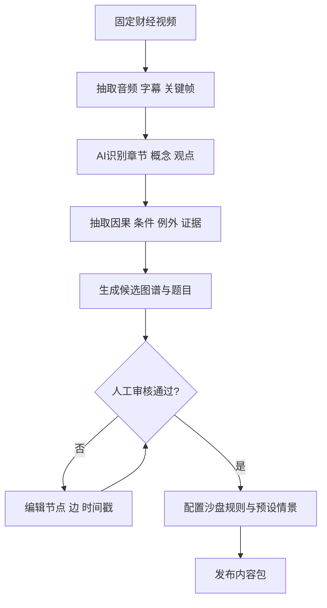
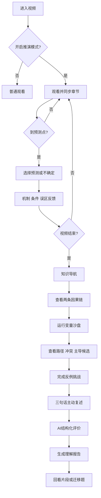
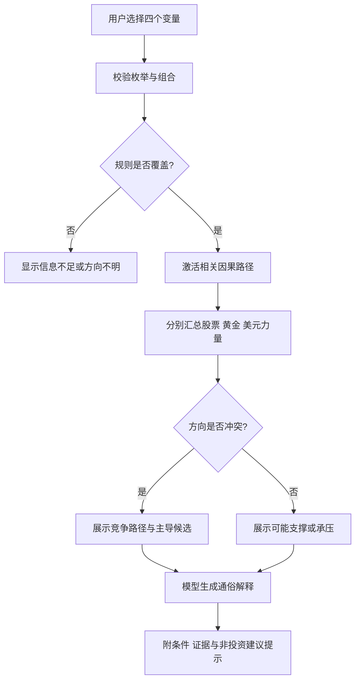
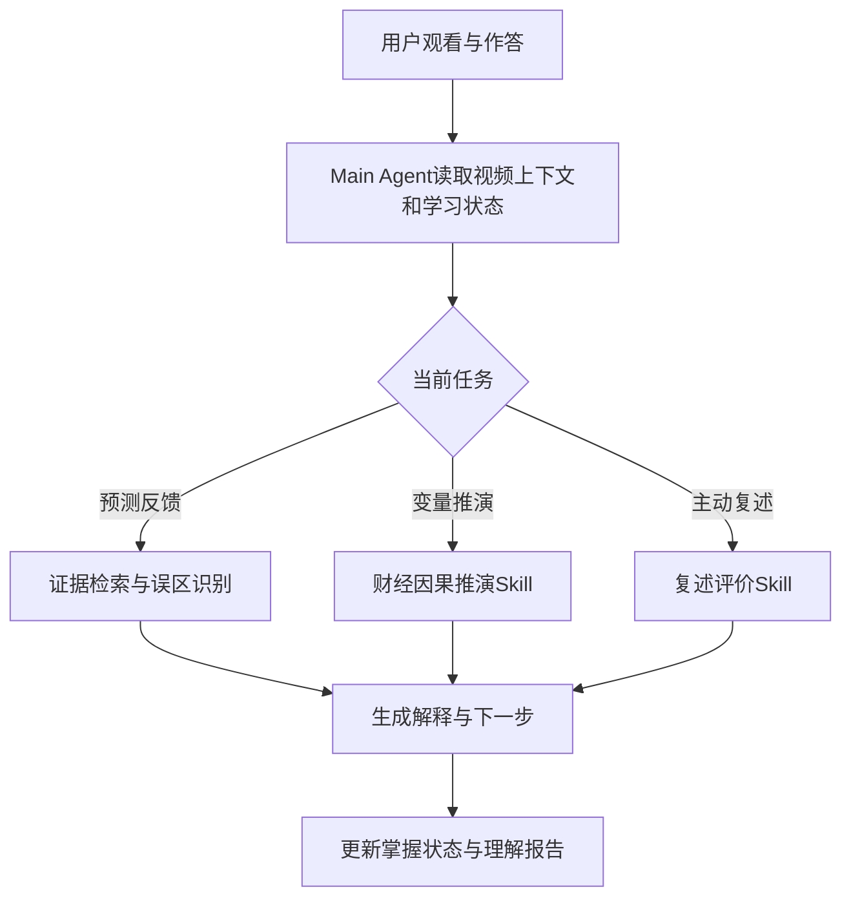

# 《财经推演室》核心流程与页面跳转

## 1. 核心闭环

财经推演室不是“视频→摘要”，而是：

**观看建立语境 → 预测暴露直觉 → 因果链补全机制 → 沙盘改变条件 → 反例校准边界 → 复述证明理解 → 报告推动迁移与复习。**

## 2. 内容生产流程

必须人工审核：5个核心概念、2条核心链的所有边、3道预测题、A/B/C情景结果、反例解释及所有原视频引用。

## 3. 用户业务流程

## 4. 运行时推演流程

## 5. 页面跳转关系

| 来源页面 | 触发 | 目标页面/组件 | 返回逻辑 |
|---|---|---|---|
| 视频详情 | 点击“开启推演模式” | 原视频播放页（模式开启） | 可随时关闭，不清除已答记录 |
| 播放页 | 到达预置时间点 | 预测暂停弹层 | 答题/跳过后回到原播放位置 |
| 播放页 | 点击概念浮签 | AI知识导航抽屉 | 关闭后续播 |
| 视频结束 | 点击“运行视频逻辑” | AI知识导航页 | 返回仍停留片尾 |
| 知识导航 | 点击某条链 | 因果链页面 | 返回保留滚动位置 |
| 因果链 | 点击节点时间戳 | 播放页指定片段 | 片段结束回因果链 |
| 因果链 | 点击“进入推演” | 变量沙盘 | 继承当前选中链 |
| 沙盘 | 首次运行完成 | 反例挑战入口解锁 | 可继续调参后进入 |
| 反例 | 完成二次回答 | 主动复述 | 可返回查看竞争路径 |
| 主动复述 | 提交/改写完成 | 理解报告 | 报告保留初答和改写差异 |
| 理解报告 | 点击推荐片段 | 播放页片段模式 | 播放后回报告 |
| 理解报告 | 点击迁移问题 | 迁移题弹层 | 完成后更新掌握状态 |

## 6. 核心交互规则

### 6.1 预测暂停

- 全片仅3个点，两个点间至少间隔2分钟；不在情绪高潮、广告口播或句中暂停。
- 弹层首屏只呈现情景和3个选项，始终提供“我不确定”和“先继续看”。
- 反馈顺序：用户判断 → 合理部分 → 缺失条件 → 视频证据 → 条件变化。
- 用户连续跳过2次后，第三次改成非阻断轻提示。

### 6.2 因果节点

- 点节点：解释概念；点箭头：解释为何A可能导致B。
- “成立条件”用绿色描边，“打断因素”用橙色描边；不能只靠颜色区分。
- 每个结果节点带“可能”；无证据或未审核的边不进入P0页面。

### 6.3 沙盘

- 改变量后页面标记“条件已变化，等待运行”，避免旧结果被误认为新结果。
- 运行后先动画展示路径，再显示资产结果，防止用户只看涨跌方向。
- 冲突时默认展开两条竞争路径；权重接近显示“主导力量未决”。
- 所有结果固定显示“知识情景推演，不构成投资建议或市场预测”。

### 6.4 主动复述

- 目标是三句话，不限定专业术语；语音转写后必须让用户确认。
- 反馈围绕七维：结论、中间因果、因果/相关、可能/必然、条件、概念、通俗度。
- 先让用户自行改写，再提供范例；避免范例替用户完成任务。

## 7. 状态机

| 状态 | 进入条件 | 可执行动作 | 完成条件 |
|---|---|---|---|
| watching | 开启推演模式 | 播放、暂停、查看概念 | 到达预测点或片尾 |
| predicting | 触发预测点 | 选答、不确定、跳过 | 查看反馈或跳过 |
| mapping | 视频结束 | 查概念、点链、回片 | 至少查看1条链 |
| simulating | 进入沙盘 | 改变量、加载预设、运行 | 至少成功运行1次 |
| challenging | 沙盘完成 | 初答、补条件 | 完成二次回答 |
| retelling | 反例完成 | 输入、提交、改写 | 至少提交1次 |
| reporting | 有学习证据 | 查看、回片、做迁移题 | 用户离开或启动复习 |

## 8. 异常与兜底流程

| 异常 | 用户可见处理 | 系统处理 |
|---|---|---|
| 视频加载失败 | “视频暂时无法加载，可先体验推演” | 进入预置知识导航，保留重试 |
| 预测题数据缺失 | 不弹题，继续播放 | 上报错误，不阻塞主流程 |
| 沙盘组合未覆盖 | “当前信息不足，暂不能判断方向” | 展示缺失变量，不调用模型补猜 |
| 模型反馈超时 | 展示规则模板反馈 | 记录超时，可后台重试 |
| 语音识别低置信 | 高亮疑似错误词，请用户确认 | 不用未确认文本评分 |
| 用户询问买卖建议 | 明确不提供建议，转为机制解释 | 标记安全事件 |
| 报告生成失败 | 展示结构化基础报告 | 使用事件数据本地生成 |

## 9. Demo推荐最短路径

## 10. Main Agent与核心Skill调用关系

运行原则：规则引擎决定路径是否激活及冲突状态，LLM负责结合视频证据解释；Main Agent根据用户错误类型决定继续追问、推荐回看、进入反例挑战或生成报告。核心推演Skill保持独立输入输出，以满足能力迁移、扩展和复用要求。

播放页（20秒）→ 预测P3故意选择“必涨”（25秒）→ 股票因果链及条件（25秒）→ 载入情景B（45秒）→ 反例补“衰退压低盈利”（35秒）→ 三句话复述（40秒）→ 理解报告（30秒）。其余时间用于开场、转场与总结，总长约4分钟。
