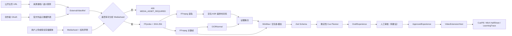

# 财包视频理解与时间轴交互架构

状态：P0 垂直切片已实现，真实内容发布仍阻塞  
代码：`refer/douyin` 分支 `feat/caibao-analysis-pipeline`

## 系统分层

## 关键不变量

1. 来源元数据不等于媒体资产；没有权利明确的媒体文件，不启动分析。
2. ASR/OCR/关键帧是证据，模型输出是候选；模型不能发布。
3. ASR 时间码优先于模型猜测；未知 evidenceId 会被管线拒绝。
4. Planner 固定最多 6 个、最小 45 秒、单次最多 12 秒，并扫描投资建议措辞。
5. 播放时不实时请求模型决定弹点；前端只消费已批准、版本化内容包。
6. 展开触点不暂停、静音或 seek 视频；无蒙层，面板不超过 48vh。

## P0 代码责任

| 位置 | 责任 |
|---|---|
| `src/features/video-extensions` | 与底座解耦的扩展匹配、上下文和媒体时钟 |
| `src/features/finance-cues` | 前端内容 schema、Cue 状态机、组件、足迹和 fixture |
| `server/src/sources` | 抖音 URL 规范化、匿名探测、授权作品元数据分页 |
| `server/src/media` | 受限导入目录、FFmpeg/FFprobe、指纹、音轨和帧 |
| `server/src/providers` | OpenAI-compatible tool 输出、豆包 ASR、火山 OCR 与原生 V4 签名 |
| `server/src/pipeline` | 证据引用检查与确定性触点规划 |
| `server/src/jobs` | P0 内存任务；进程重启后丢失是已知限制 |
| `server/src/app.ts` | readiness、来源探测、分析任务与草稿 API |

## Provider 选择

### MiniMax 方案

- `MINIMAX_BASE_URL=https://api.minimaxi.com/v1`
- 文本默认 `MiniMax-M2.7`。
- `MINIMAX_MULTIMODAL_MODEL` 默认留空；操作者确认账号权限后填写可用的视觉模型，当前代码不自动探测模型授权。留空时使用 transcript/OCR 文本并不发送关键帧。
- 结构数据由 tool/function 参数返回，再经 Zod 校验；不假定原生 JSON Schema 支持。

### 豆包方案

- `ARK_BASE_URL=https://ark.cn-beijing.volces.com/api/v3`
- `ARK_MODEL`/`ARK_MULTIMODAL_MODEL` 使用控制台可用的 Model ID 或 `ep-...`。
- ASR 与方舟 API key 分离；OCR 又使用独立 AK/SK。
- OCRNormal 使用 Node `crypto` + `fetch` 实现火山 V4 签名，签入 `content-type;host;x-content-sha256;x-date`，不依赖通用 OpenAPI SDK。

## 失败降级

| 失败 | 行为 |
|---|---|
| 公开主页只返回风控壳 | `dynamic_page_blocked`，建议 OAuth 或人工导入 |
| 只有作品元数据/iframe | `409 MEDIA_ASSET_REQUIRED` |
| 无权利声明 | `403 MEDIA_RIGHTS_NOT_ATTESTED` |
| FFmpeg 不存在 | readiness 和任务返回 `MEDIA_TOOL_UNAVAILABLE` |
| 模型 key/model 缺失 | readiness 返回缺失变量名，不返回变量值 |
| 模型超时/429/无效结构 | 任务失败为类型化错误，不产生 approved 内容 |
| 服务进程重启 | P0 内存任务丢失；前端静态已批准内容不受影响 |

## P1 设计缺口

- 对象存储上传、病毒/MIME 魔数扫描、短时签名 URL。
- OAuth state、token 加密存储、撤销与刷新完整流程。
- 场景切换抽帧与长视频分段/并发控制。
- 审核台、review/publish API、ApprovedExperience 持久化。
- PostgreSQL/队列、租户隔离、审计日志和额度控制。
- FFmpeg 子进程超时、任务并发/TTL、派生文件清理与独立媒体 worker。
- 前端 `StaticExperienceRepository` 切换为 API + 缓存的生产仓储。
