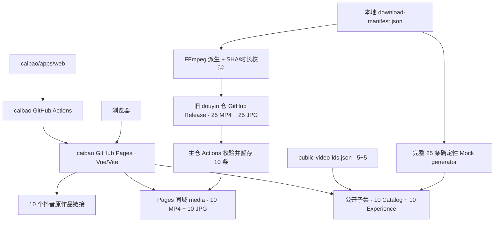
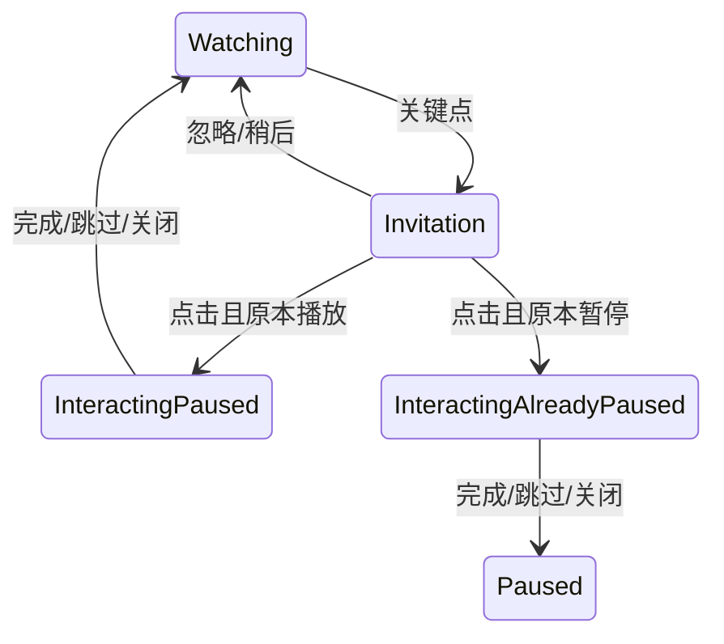
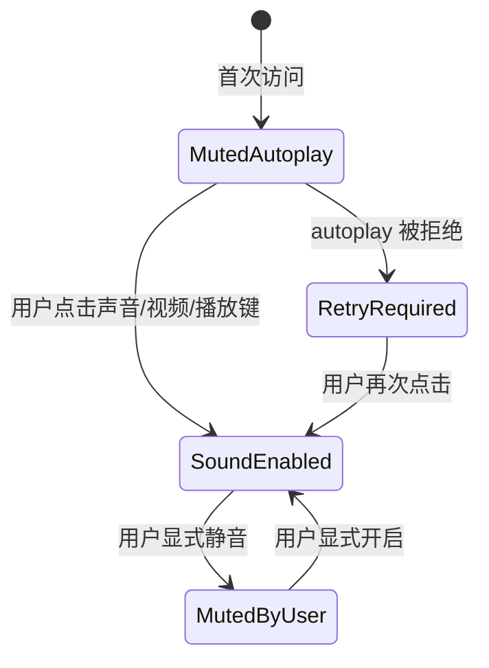

# 财包｜V2.7 架构

状态：PRD V2.7 Review Candidate 配套架构  
日期：2026-07-23  
唯一代码源：`wzxsph/caibao/apps/web`  
导入源：`wzxsph/douyin@9a461b89dda782e30db2fd399b29068e95d3ec33`

## 1. 架构目标

把“合法视频输入 → 多模态证据 → 候选触点 → 人工审核 → 播放中轻交互 → 证据报告”拆成可验证、可回滚的层。当前公开原型只实现其中的媒体目录、确定性 Mock 内容、播放器交互与静态部署，不能将目标管线写成 As-Is。

## 2. 当前公开原型（As-Is）

### 2.1 发布对象

- 主 Pages：<https://wzxsph.github.io/caibao/#/home>；旧 `/douyin/` 只作迁移期历史预览。
- App：`Vue 3 + Vite + TypeScript`，仅推荐流和作者页。
- Source：前端、Express、生成管线和测试全部位于 `apps/web/`；旧应用仓不再双向维护。
- Release：`showcase-media-20260723-v1`，50 个资产、174,689,523 bytes。
- Bundle：提交内生成 JSON 保留 25 条目录、25 个 `internal_poc` Experience、141 个 automatic 触点；运行时按配置过滤为 10 条。
- 作者页：公开 `xiaolin=5`、`dalu-xing-lu=5`；完整源分布仍为 15/10。
- Delivery：浏览器只请求 Pages 同域 `/douyin/media/*.mp4`；Release 作为 Actions 构建源，不再是运行时媒体域。

### 2.2 内容边界

当前 `server/src/showcase/mock-content-generator.ts` 只使用标题和 manifest 元数据，以确定性模板生成候选。它没有运行最终 ASR、OCR 或视觉模型；`estimated_mock` 时间码不能进入生产 Approved 内容。

当前每视频 3–6 个触点来自视频时长、45 秒间隔和六类模板。代码与契约不得重新引入 `maxAutomaticCues=4`；6 也不是产品上限。

## 3. 生产目标（To-Be）

```mermaid
flowchart LR
  Rights["Rights Gate"] --> Normalize["FFmpeg Normalize"]
  Normalize --> ASR["ASR"]
  Normalize --> OCR["OCR"]
  Normalize --> Vision["Vision"]
  ASR --> Evidence["Evidence Timeline"]
  OCR --> Evidence
  Vision --> Evidence
  Evidence --> Semantic["Semantic Graph"]
  Semantic --> Repair["Critic / Schema Repair"]
  Repair --> Planner["Deterministic Planner"]
  Planner --> Payload["Six Cue Payloads"]
  Payload --> Coverage["Coverage + Blockers"]
  Coverage --> Draft["DraftExperience"]
  Draft --> Review["ReviewManifest"]
  Review --> Approved["Immutable ApprovedExperience"]
  Approved --> API["Runtime API"]
  API --> Player["Video + Cue Orchestrator"]
  Player --> Events["LearningTraceEvent"]
  Events --> Report["EvidenceReport"]
```

## 4. 分层责任

| 层            | 责任                                       | 不允许                                     |
| ------------- | ------------------------------------------ | ------------------------------------------ |
| Source/Rights | 来源 URL、作者、用途、期限、下架、指纹     | 以“公开可见”代替权利证据                   |
| Media         | 容器、编码、时长、Range、派生指纹          | 覆盖源文件、把视频提交 Git                 |
| Evidence      | ASR/OCR/视觉证据与时间窗                   | 无 evidenceId 的财经结论                   |
| Generation    | 生成 Draft 概念、因果、条件、反例、Payload | 直接批准或改变确定性规则                   |
| Planner       | 证据/价值/间隔/重复度优化                  | 固定截断为最多 4/6 个                      |
| Review        | 权利、时间码、财经、安全、测试签字         | 模型代签或 generated→published 跳级        |
| Runtime       | 播放状态、Cue、会话、事件、报告            | 自动 seek、改音量、伪造掌握证据            |
| Delivery      | Pages/API/媒体分发与回滚                   | 到期后保留可访问 Release 或 Pages 媒体直链 |

## 5. 播放交互协议

- `pause-for-interaction(interactionId)` 捕获真实 `wasPlayingBeforeInteraction` 和位置。
- `release-interaction(interactionId, reason, allowResume)` 幂等恢复。
- 财包状态机不写 `currentTime`、`muted`、`volume`、`playbackRate`；用户显式声音动作可修改 `muted`。
- 半屏打开期间屏蔽背景点击播放；上下文切换不自动恢复旧视频。

### 5.1 浏览器声音策略

- 首次先静音尝试自动播放，同时展示 44px 有声入口。
- unmute 与 `play()` 必须在同一次用户手势中执行；成功后保存站点声音偏好。
- `play()` 被拒绝时显示可重试状态，不把媒体标记为损坏，也不伪造播放成功。

## 6. 目录与媒体

### 6.1 当前静态路径

1. `prepare:showcase-media` 读取忽略的 manifest，生成 H.264/AAC `yuv420p` fast-start 视频和 JPG。
2. `generate:showcase-content` 生成 Schema 校验的静态 bundle。
3. 25 组视频/封面保留在旧 `douyin` Release；bundle、10 条公开配置和代码进入 `caibao` Git，媒体不进入 Git。
4. Pages 构建设置 `VITE_SHOWCASE_MEDIA_BASE_URL=./media/`，再由 `stage:showcase-pages-media` 校验公开 10 条 SHA/bytes/格式并写入临时 artifact。
5. 浏览器从 Pages 同域读取 `video/mp4`，必须支持 200/206 和 `Accept-Ranges`，不再经历 Release 302 与 attachment 响应。

### 6.2 本地 Express 路径

- `GET /api/finance/v1/media/catalog`
- `GET|HEAD /api/finance/v1/media/:videoId/video`
- `GET|HEAD /api/finance/v1/media/:videoId/poster`

Catalog 校验 Schema、授权状态、路径 containment、bytes、SHA-256、FFprobe 时长/编解码。任何失败 fail closed；不回退旧推荐池。

### 6.3 到期差异

本地 API 可在期限到达后返回空目录/410，但静态 Release 与现有 Pages artifact 不会自动删除。生产运行手册必须先删除/下架 Release，再部署不含媒体的 Pages artifact 与空目录，最后验证两类直链不可访问。

## 7. 内容、会话与发布 API

### 7.1 内容

- `GET /api/finance/v1/experiences/:videoId`
- `PATCH /api/finance/v1/analysis/jobs/:jobId/draft`
- `POST /api/finance/v1/analysis/jobs/:jobId/reviews`
- `POST /api/finance/v1/analysis/jobs/:jobId/publish`

普通播放器只读 Approved 内容。版权、证据、时间码、财经审核或 Schema blocker 未关闭时发布返回 409。

### 7.2 会话

- `POST /api/finance/v1/sessions`
- `GET /api/finance/v1/sessions/:sessionId`
- `POST /api/finance/v1/sessions/:sessionId/events`
- `POST /api/finance/v1/sessions/:sessionId/simulations`
- `POST /api/finance/v1/sessions/:sessionId/retell-evaluations`
- `GET /api/finance/v1/sessions/:sessionId/report`

P0 可用 Express 内存态 + `localStorage` 镜像；事件以 `eventId` 幂等。PostgreSQL、队列、对象存储和正式审核后台是 P1。

## 8. 模型与规则边界

- Provider adapter 输出统一结构化 Schema。
- 只对 `PROVIDER_INVALID_RESPONSE` 进行有限修复；鉴权、超时、网络和费用错误走降级。
- LLM 只能生成 Draft、受限追问和复述评价；规则方向、发布状态和报告事实为确定性逻辑。
- MiniMax 和豆包密钥只在服务端 ignored env；Pages 不包含密钥。

## 9. 版本向量

批准内容必须分别固定：PRD baseline、contentVersion、schemaVersion、ruleVersion、planner/weightVersion、promptVersion、appCommit、mediaFingerprint、subtitleVersion。当前展示还应记录 `mediaRelease=showcase-media-20260723-v1` 和 `generation.mode=mock`。

## 10. 失败与回滚

- Bundle/Schema 失败：构建失败，不部署。
- 单媒体失败：剔除并记录，不替补旧视频。
- 模型失败：模板反馈，用户仍可完成/退出。
- 播放恢复失败：保持暂停，不伪造 `resumed`。
- 权利撤回/到期：下架 Release，并重新部署不含媒体的 Pages artifact 与目录移除/空态。
- Pages 故障：回滚到已验证的同域媒体版本；不得回滚到浏览器直连 Release 的旧提交。

## 11. 当前技术债

- 静态 `internal_poc` bundle 与未来 Approved API 尚未硬隔离为部署策略。
- 真实 ASR/OCR/视觉证据链未在 25 条上建立。
- Review/Publish 与 Session/Event/Report 未闭环。
- Release 与 Pages 媒体到期下架仍需负责人、提醒和操作手册。
- 公开 10 条逐媒体与六类 E2E 尚未完整执行；当前 9 项 E2E 覆盖代表路径、四视口和首次有声入口。
