# 财包视频理解与时间轴交互架构

状态：P0 垂直切片已实现，V2.5 为最新 Review Candidate；进入暂停状态机尚未实现，真实内容发布仍阻塞  
代码 checkpoint：`refer/douyin` 的 `feat/caibao-analysis-pipeline@b8ced09d`
（Planner 4/45 + 六类成稿）。未 push 的 `refactor/moneybaby-v2.4-foundation@4b34da1f`
在其上增加默认前端回环绑定。共享工作树由外部 Agent 使用，当前检出状态不是稳定架构事实。

> 产品候选：`财经推演室_PRD_V2.5.md`。V2.5 沿用独立版本向量、ReviewManifest 与受控
> draft PATCH、ReviewManifest、job publish（物化 approved）与 content publish/retire（运行指针）
> 门禁，并把播放规则改为“邀请不暂停、进入自动暂停、退出按原状态恢复”。这些是目标架构，
> 不能因文档存在描述为代码已实现。

## 系统分层

```mermaid
flowchart LR
  A["公开主页 URL"] --> B["来源建档 / 语义探测"]
  C["创作者 OAuth"] --> D["官方作品元数据列表"]
  E["用户上传或授权存储媒体"] --> F["MediaAsset + 权利声明"]
  B --> G["ExternalVideoRef"]
  D --> G
  G --> H{"是否有可分析 MediaAsset"}
  F --> H
  H -- "否" --> I["409 MEDIA_ASSET_REQUIRED"]
  H -- "是" --> J["FFprobe + SHA-256"]
  J --> K["FFmpeg 音轨"]
  J --> L["FFmpeg 关键帧"]
  K --> M["豆包 ASR 毫秒时间码"]
  L --> N["OCRNormal"]
  M --> O["证据融合"]
  N --> O
  L --> P1["语义抽取 emit_semantic_graph"]
  O --> P1
  P1 --> P2["确定性校验 + 证据引用"]
  P2 --> P3["可选语义评审 emit_critique"]
  P3 --> P4["定向修复环 ≤2 轮"]
  P4 --> P5["评分 cue-scorer + 确定性 Planner"]
  P5 --> P6["方向规则引擎 direction-rules"]
  P6 --> P7["payload 授权 payload-author ≤2 轮"]
  P7 --> Q["Zod Schema + 终检禁词"]
  Q --> S["DraftExperience"]
  Q --> CR["CoverageReport / 查漏补缺清单"]
  S --> T["ReviewManifest / 人工审核（待建设）"]
  CR --> T
  T --> AP["独立批准动作（待建设）"]
  AP --> U["不可变 ApprovedExperience"]
  U --> PP["可回滚发布指针（待建设）"]
  PP --> V["VideoExtensionHost"]
  V --> W["CuePill / 48vh HalfSheet / LearningTrace"]
```



> 生成管线的多阶段循环见 `docs/GENERATION_PIPELINE_DESIGN.md` 与
> `docs/ADR/0003-agentic-generation-pipeline.md`。上图 P1–P7 已在代码提交
> `50b96560` 实现核心管线，`b8ced09d` 已把自动邀请默认/硬上限收紧为 4 并开放六类
> server payload 成稿；`CoverageReport` 已作为按内容版本生成的确定性审核门产物。
> 当前结论只由离线 fake client 测试和静态 fixture 证明；真实授权媒体、真实供应商、
> 完整六类真实时间轴 E2E、人工审核与发布链路仍未验证。

## 关键不变量

1. 来源元数据不等于媒体资产；没有权利明确的媒体文件，不启动分析。
2. ASR/OCR/关键帧是证据，模型输出是候选；模型不能发布。
3. ASR 时间码优先于模型猜测；未知 evidenceId 会被管线拒绝。
4. 内容节点最多 6 个；自动邀请默认值和硬上限已在 `b8ced09d` 收紧为 4、最小 45 秒、
   单次最多 12 秒，并扫描投资建议措辞。PM 六节点仍需 adapter 选择，不能按原间隔直接发布。
5. 播放时不实时请求模型决定弹点；前端只消费已批准、版本化内容包。
6. 邀请曝光不暂停；用户进入触点时记录 `wasPlayingBeforeInteraction` 和 `pausePositionMs` 后暂停。
   完成、跳过或关闭时仅在进入前正在播放的情况下从原位置恢复；不得自动 seek、静音、改音量或倍速。
   无蒙层，面板不超过 48vh。当前代码仍是 V2.4 不停播实现，必须先补失败测试再重构。
7. 媒体、作者头像/昵称、来源 URL、字幕和内容包版本必须一致；财包不得替换作者身份。
8. PRD、内容、Schema、规则、Planner 权重、Prompt、应用提交和媒体指纹独立版本化；
   Review Candidate 只能生成 draft，approved 内容必须引用已批准 PRD tag。

## PM 内容包迁移边界

`refer/moneybaby` 固定在 `7db765b`，只作为内容与 UI 取证来源。迁移链路固定为：

```text
PM VideoContentPackage (draft)
→ adapter + media/author/version validation
→ DraftExperience + CoverageReport
→ ReviewManifest + human review
→ independent approval
→ immutable ApprovedExperience
→ rollbackable publish pointer
```

- 可迁移：视频元数据、章节、字幕候选、六节点学习意图、证据窗口、复述/报告信息结构。
- 可迁移但必须重写：用户主动进入后暂停这一基础意图；退出恢复必须按 V2.5 的进入前状态实现。
- 不迁移：React/Vinext 页面、Cloudflare 运行栈、自动 seek、全屏 shade、88%–94% Sheet、财包占作者头像位、二选一与静态能力印章。
- PM 视频仍缺公开分发授权，概念与因果边均未审核；Schema 适配成功不改变其 `draft` 状态。
- 首包主题以美元外溢、全球资本、本国周期和相对利差为准，不向报告注入视频未覆盖的股票/黄金能力。

## P0 代码责任

| 位置 | 责任 |
|---|---|
| `src/features/video-extensions` | 与底座解耦的扩展匹配、上下文和媒体时钟 |
| `src/features/finance-cues` | 前端内容 schema、Cue 状态机、组件、足迹和 fixture |
| `server/src/sources` | 抖音 URL 规范化、匿名探测、授权作品元数据分页 |
| `server/src/media` | 受限导入目录、FFmpeg/FFprobe、指纹、音轨和帧 |
| `server/src/providers` | OpenAI-compatible tool 输出、语义抽取/评审/修复、豆包 ASR、火山 OCR 与原生 V4 签名 |
| `server/src/pipeline` | 语义时间轴、有界修复、评分与 Planner 4/45、方向规则、六类 payload 成稿、CoverageReport |
| `server/src/jobs` | P0 内存任务与 draft/CoverageReport；进程重启后丢失是已知限制 |
| `server/src/app.ts` | readiness、来源探测、分析任务、草稿与 coverage API |
| Review/Publish Gate（目标） | draft PATCH、ReviewManifest、job publish、content publish/retire、权限/幂等/审计；当前未实现，P0 可先用同契约 CLI |
| `refer/moneybaby/.../app/content` | PM 参考内容结构；不得成为运行时第二内容仓 |

## Provider 选择

### MiniMax 方案

- `MINIMAX_BASE_URL=https://api.minimaxi.com/v1`
- 文本默认 `MiniMax-M2.7`。
- `MINIMAX_MULTIMODAL_MODEL` 默认留空；操作者确认账号权限后填写可用的视觉模型，当前代码不自动探测模型授权。留空时使用 transcript/OCR 文本并不发送关键帧。
- 结构数据由 tool/function 参数返回，再经 Zod 校验；不假定原生 JSON Schema 支持。

### 豆包方案

- `ARK_BASE_URL=https://ark.cn-beijing.volces.com/api/v3`
- `ARK_MODEL`/`ARK_MULTIMODAL_MODEL` 使用控制台可用的 Model ID 或 `ep-...`。
- ASR 与方舟 API key 分离；OCR 又使用独立 AK/SK。
- OCRNormal 使用 Node `crypto` + `fetch` 实现火山 V4 签名，签入 `content-type;host;x-content-sha256;x-date`，不依赖通用 OpenAPI SDK。

## 失败降级

| 失败 | 行为 |
|---|---|
| 公开主页只返回风控壳 | `dynamic_page_blocked`，建议 OAuth 或人工导入 |
| 只有作品元数据/iframe | `409 MEDIA_ASSET_REQUIRED` |
| 无权利声明 | `403 MEDIA_RIGHTS_NOT_ATTESTED` |
| FFmpeg 不存在 | readiness 和任务返回 `MEDIA_TOOL_UNAVAILABLE` |
| 模型 key/model 缺失 | readiness 返回缺失变量名，不返回变量值 |
| 模型超时/429/无效结构 | 任务失败为类型化错误，不产生 approved 内容 |
| 服务进程重启 | P0 内存任务丢失；前端静态已批准内容不受影响 |

## 版本与发布链

批准内容必须固化以下版本向量：`prdBaseline`、`contentVersion`、`schemaVersion`、
`ruleVersion`、`weightTableVersion`、`promptVersion`、`appCommit`、`mediaFingerprint`。
模型/adapter 只能创建 draft；reviewed、approved、published 是三个不同状态，修改产生新内容版本。
完整规则见 `docs/VERSION_GOVERNANCE.md`。

## P1 设计缺口

- 对象存储上传、病毒/MIME 魔数扫描、短时签名 URL。
- OAuth state、token 加密存储、撤销与刷新完整流程。
- 场景切换抽帧与长视频分段/并发控制。
- 完整审核 UI、企业级权限/双人复核、ApprovedExperience 持久化；P0 仍必须先完成可测试的
  draft PATCH、ReviewManifest、job publish 与 content publish/retire 动作，不能继续用手改 fixture 代替发布。
- PostgreSQL/队列、租户隔离、审计日志和额度控制。
- FFmpeg 子进程超时、任务并发/TTL、派生文件清理与独立媒体 worker。
- 前端 `StaticExperienceRepository` 切换为 API + 缓存的生产仓储。
