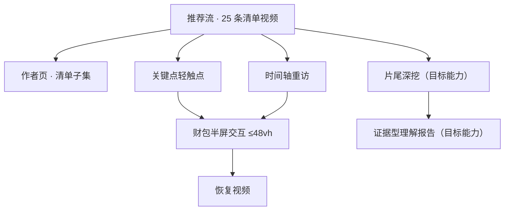
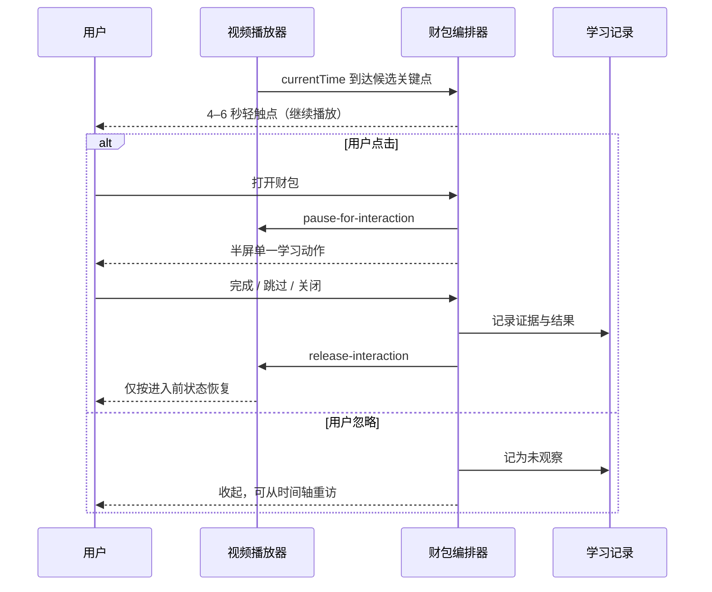
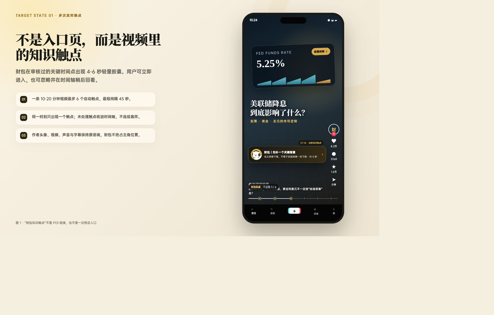
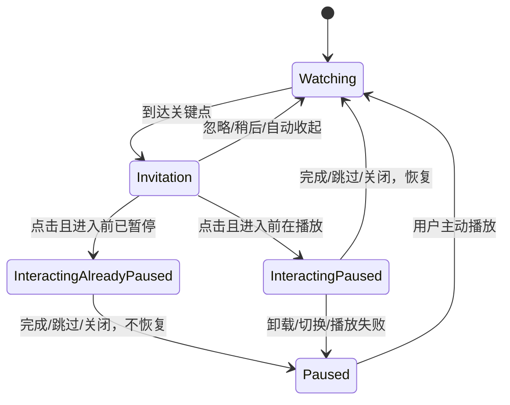
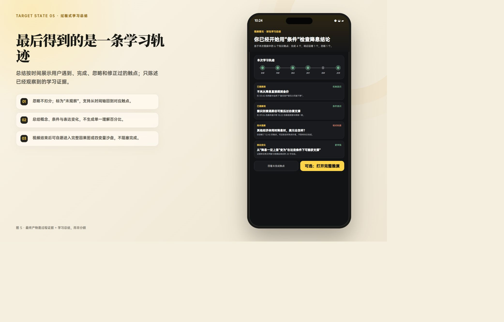
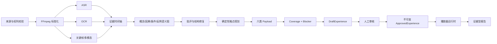
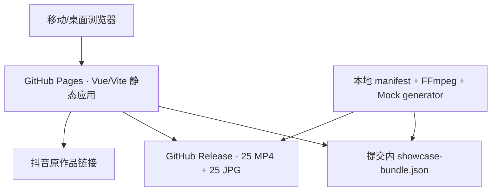

# 财经推演室

## 产品需求文档 PRD V2.7

状态：**Review Candidate（未批准）**  
日期：2026-07-23  
Markdown：唯一内容源  
当前已批准基线：PRD V2.0  
上一候选：PRD V2.6（历史候选）  
线上工程原型：<https://wzxsph.github.io/douyin/#/home>

> V2.7 记录 25 条清单内容、公开展示原型、推荐流 + 作者页、确定性 LLM Mock 和取消自动触点固定数量上限。它不代表财经内容、版权链或生产发布已经完成联合审批。

---

# 0. 文档控制与一页决策

## 0.1 事实标签

本文使用四种标签，评审时不得混用：

- **[现状事实]**：可以由当前代码、Git、清单、测试或线上页面复现。
- **[产品决策]**：用户已直接裁决或本候选建议团队统一执行的行为。
- **[假设]**：需要真实数据或责任人验证。
- **[发布阻塞]**：未关闭前不得声称 production approved。

## 0.2 一页决策

| 主题 | V2.7 统一口径 |
|---|---|
| 产品定义 | 面向财经长视频的移动 Web/PWA 观看中轻交互与因果推演体验 |
| 当前公开形态 | 竖屏推荐流 + 作者作品页；25 条清单视频全部进入工程展示 |
| 入口 | 视频关键点出现财包轻触点；不是外链、不是页面跳转 |
| 播放 | 入口曝光不停播；点击进入暂停；完成、跳过或关闭后恢复进入前状态 |
| 面板 | 无蒙层，最高 48vh；作者头像与财包严格分离 |
| 触点数量 | 不设“最多 4 个”或“最多 6 个”等产品级固定上限；至少间隔 45 秒、同时最多 1 个 |
| 交互类型 | 背景卡、快速判断、因果拼接、条件滑杆、反例翻转、概念辨析 |
| 当前内容 | 确定性 LLM Mock，只基于标题和 manifest 元数据；不是最终多模态分析 |
| 真实生产链 | 权利校验 → FFmpeg → ASR/OCR/视觉 → 证据时间轴 → 语义图 → 候选触点 → 人审 → 发布 |
| 媒体来源 | `download-manifest.json` 是当前目录唯一事实源；不得回退旧推荐池 |
| 归属 | 每条展示清单作者、真实标题和抖音原作品链接；不伪造互动数据 |
| 报告 | 过程式、证据型学习总结；无总分、虚假百分比或投资建议 |
| 当前状态 | 可访问工程原型，不是生产内容发布；V2.7 仍待联合评审 |

## 0.3 本轮用户直接裁决

以下决定即时覆盖所有旧文档中的相反条款：

1. 当前清单 25 条全部进入展示，而不是固定 4 条。
2. 普通推荐只读取清单派生目录，不出现底座原视频或旧 mock。
3. 入口曝光继续播放，用户主动点开财包后自动暂停。
4. 退出财包时恢复进入前播放状态，不 seek、不改变音量/静音/倍速。
5. 自动触点不设固定数量上限；旧“最多 4 个”限制取消。
6. 原型可通过 GitHub Pages 公开展示，媒体单独放 GitHub Release，并逐条标注作者和原作品。
7. 当前学习内容必须明确标注 LLM Mock、未用最终 ASR/OCR、未经财经审核、非投资建议。

## 0.4 当前可复现基线

| 对象 | 精确引用 |
|---|---|
| 应用仓 `master` | `e85de2bfa1743aaea5204f6e1513de6d56c2e310` |
| 应用 PR | <https://github.com/wzxsph/douyin/pull/3> |
| Pages 工作流 | <https://github.com/wzxsph/douyin/actions/runs/29955704172>，成功 |
| 媒体 Release | `showcase-media-20260723-v1`，50 个资产，174,689,523 bytes |
| Catalog / Experience | 25 / 25 |
| 作者分布 | 小Lin说 15；大陆姓陆 10 |
| 触点 | 141 个，全部为 `automatic`；当前每视频 3–6 个 |
| 测试 | client 44、server 131、Playwright 8，均通过 |

---

# 1. 问题、用户与价值

## 1.1 用户问题

财经长视频经常同时包含概念、事实、因果、条件和立场。用户能“看完”，却未必能回答：

- 结论依赖什么前提？
- 中间机制是什么？
- 哪条证据支持或反驳？
- 条件变化时结论是否翻转？
- 自己真正理解了什么、还缺什么？

传统评论区太散，独立课程或聊天页又打断观看。财包的价值是把最小必要的学习动作嵌入时间轴，并把互动证据汇总成可追溯的理解记录。

## 1.2 目标用户

- 希望看懂财经机制、但不会主动做笔记的普通用户。
- 习惯竖屏视频，希望交互短、轻、可跳过的用户。
- 需要区分“视频说了什么”与“在什么条件下成立”的用户。

非目标用户：寻找交易信号、仓位建议、目标价、实时行情或个性化投资组合的用户。

## 1.3 核心价值假设

**[假设]** 相比“看完后统一答题”，在证据附近出现 8–12 秒的轻交互，更容易让用户补齐机制、条件和反例，同时不显著增加观看中断感。

验证信号：打开率、完成率、恢复播放成功率、重访率、前后复述差异、严重概念错误召回和退出率，而不是单一总分。

---

# 2. 范围与信息架构

## 2.1 当前 P0 展示范围

- 25 条清单视频的推荐流。
- 两个作者页，各自只展示清单内作品。
- 六类观看中轻交互。
- 时间轴重访入口。
- 进入暂停、退出恢复的播放状态机。
- 原作品链接、作者归属、AI 生成披露和项目说明。
- 确定性 Mock 内容 bundle 与可复现媒体准备命令。

## 2.2 生产目标范围

- 合法输入视频与权利记录。
- ASR、OCR、关键帧/视觉理解和证据时间轴。
- 候选概念、背景、问题、条件与反例生成。
- Coverage/Blocker、人审、Approved/Published 生命周期。
- 会话、事件、复述评价和证据型学习报告。

## 2.3 P0 明确不做

- 任意用户上传、全站爬取或绕过平台风控。
- 实时行情、买卖建议、仓位、目标价、稳赚判断。
- 财富画像、风险偏好推断、原始语音长期保存。
- 常驻悬浮球、独立聊天首页或由模型自由控制交易方向。
- 把标题 Mock 包装成已完成 ASR/OCR/财经审核的正式内容。

## 2.4 信息架构



---

# 3. 当前目录、归属与权利

## 3.1 唯一目录源

**[产品决策]** 当前推荐集合必须严格等于应用仓
`media-import/authorized-douyin/download-manifest.json` 的有效条目集合。不得从 `posts6.json`、`videos.md`、旧视频 URL、随机评论或底座 fixture 补位。

校验失败时：

- 单条失败：剔除该条并记录原因。
- 清单整体失败或有效条数为 0：显示“暂无可用授权视频”。
- 不允许静默回退旧内容。

## 3.2 当前清单事实

- 25 个不同视频 ID。
- 小Lin说 15 条；大陆姓陆 10 条。
- 当前线上 bundle 为每条保存标题、作者、作者 slug、原作品 URL、观察到的发布时间、AI 生成披露、时长、尺寸和指纹。
- 页面不展示伪造点赞数、评论数、远程头像或官方认证。

## 3.3 归属呈现

每条卡片至少显示：

1. 作者昵称与作者页入口；
2. 清单标题；
3. “查看抖音原作品”链接；
4. 若清单观察到原页 AI 生成标识，则同步披露；
5. 财包内容生成范围与未审核说明。

## 3.4 权利与期限

**[现状事实]** 本轮公网展示依据用户 2026-07-23 的直接要求执行；项目未独立完成权利链法律核验。Release 说明不宣称平台或作者官方授权。

**[发布阻塞]** 当前记录窗口截至 2026-08-22（Asia/Shanghai）。未取得续期前：

- 必须下架/删除 `showcase-media-20260723-v1`；
- 推荐页停止提供媒体；
- 不得只依靠前端隐藏，因为 Release 直链仍可访问；
- 保留最小审计记录，不继续分发媒体副本。

---

# 4. 用户旅程与关键页面

## 4.1 完整旅程



## 4.2 推荐流

- 竖向整屏/近整屏滚动，一次聚焦一条视频。
- 非当前卡片不自动播放；切换卡片释放上一条交互状态。
- 右侧作者位保持来源作者，不放财包头像。
- 财包只出现在轻触点、面板标题、反馈和学习记录。
- 页面提供 1/25 等当前位置提示及上一条/下一条无障碍按钮。



图 1：入口关系参考。该图是历史代码渲染目标图；V2.7 的实际工程页面与文案以线上原型和 `e85de2bf` 为准。

## 4.3 作者页

- 只显示该作者在当前清单中的作品，不冒充抖音官方主页。
- 标题下明确“本页不是官方账号主页”。
- 卡片提供原作链接、观察到的发布时间和时长。
- 当前两个固定 slug：`xiaolin`、`dalu-xing-lu`。

## 4.4 轻触点

- 推荐尺寸：高度 44px，最大宽度约 216px，财包图标 24px。
- 文案为 `cueLabel + prompt`，单行省略；完整文案进入无障碍标签。
- 入口 4–6 秒自动收起，收起不等于失败；可从时间轴重访。
- 入口与“稍后”动作的命中区均至少 44×44px。
- 无页面跳转、无整屏遮罩，不遮挡作者核心信息。

## 4.5 半屏面板

- 无蒙层，最高 48vh；视频仍保留至少 52% 可见区域。
- 每次只完成一个动作，目标不超过 12 秒。
- 明确提供完成、跳过、关闭；三种退出都执行相同播放释放协议。
- 半屏打开期间，视频背景点击不得误触播放。

---

# 5. 播放状态机

## 5.1 规范状态



## 5.2 核心契约

```ts
type PlaybackPolicy = {
  invitation: 'continue'
  interaction: 'pause'
  exit: 'restore_previous'
}

type PauseForInteraction = {
  type: 'pause-for-interaction'
  interactionId: string
}

type ReleaseInteraction = {
  type: 'release-interaction'
  interactionId: string
  reason: 'complete' | 'skip' | 'close' | 'unmount' | 'context_change'
  allowResume: boolean
}
```

## 5.3 不变量

- 真实 `video` 元素记录 `wasPlayingBeforeInteraction` 和 `pausePositionMs`。
- 同一 `interactionId` 的 pause/release 幂等。
- 原本暂停、已结束、卸载或上下文切换时不得误恢复。
- 不写 `currentTime`；时间轴“回看”只有用户主动选择时才允许 seek。
- 不修改 `muted`、`volume`、`playbackRate`。
- 恢复不得调用会顺带把音量设为 1 的通用播放器方法。
- 播放器拒绝 `play()` 时保留暂停状态，不伪造已恢复事件。

---

# 6. 触点编排与六类交互

## 6.1 数量与频率

**[产品决策]** 自动触点不设固定数量上限。系统不得在第 4 个或第 6 个合格节点处机械截断。

保留以下约束：

- 相邻自动邀请至少 45 秒。
- 同一时刻最多 1 个邀请或面板。
- 每个节点有证据、学习目标、优先级和预计交互时长。
- 密集候选由确定性 Planner 按证据强度、学习价值、时长预算和重复度选择。
- 时间轴可以保留未自动展示的节点；`timeline_only` 必须由内容编排显式指定。

**[现状事实]** 当前 Mock 每条 3–6 个、共 141 个，原因是只有六类模板且视频时长有限；这不是产品硬上限。

## 6.2 六类模板

| CueKind | 用户动作 | 学习目的 | 典型时长 |
|---|---|---|---:|
| `context_card` | 看一个概念/背景差异 | 补足理解前提 | 6–10s |
| `quick_judgment` | 从有意义选项中判断 | 暴露绝对化或信息不足 | 8–12s |
| `causal_stitch` | 选择中间机制 | 补齐因果链 | 8–12s |
| `condition_slider` | 只改变一个条件 | 理解路径强弱与条件性 | 8–12s |
| `counterexample_flip` | 判断反例是否翻转结论 | 建立边界意识 | 8–12s |
| `concept_compare` | 区分易混概念 | 减少概念混淆 | 6–10s |

## 6.3 反馈文案

- 使用“当前证据更支持”“还缺一个条件”“这条机制被压制”等条件语言。
- 不使用“必涨、利好、买入、目标价、稳赚”等投资导向措辞。
- 跳过只记录为“未观察”，不能写成错误。
- 模型或内容失败时使用确定性模板，用户仍可退出并继续播放。

---

# 7. 片尾深挖与学习总结

## 7.1 目标闭环

观看中轻交互完成后，片尾可进入：

1. 完整逻辑地图；
2. 条件沙盘；
3. 反例挑战；
4. 三句话复述；
5. 证据型理解报告。

## 7.2 沙盘

- 用户先改变量，再点击“运行这组条件”。
- 结果先显示激活路径，再显示 `support_dominant | pressure_dominant | conflict | insufficient`。
- 相同输入、相同规则版本必须得到完全一致结果。
- 未知组合返回“信息不足”；LLM 无权改变资产方向或规则结果。

## 7.3 报告

报告只由事件与证据生成，包含：

- 已观察证据与完成/跳过节点；
- 已掌握概念与缺失机制；
- 条件意识、反例意识和常见错误模式；
- 前后复述差异；
- 可回看片段、迁移题和下一步。

不得显示总分、“68%”等虚假精度、财富画像、风险偏好或交易建议。



图 2：报告信息结构参考。实际报告必须由真实学习事件生成，不能直接复用图中的示例数据。

---

# 8. 视频理解与内容生成管线

## 8.1 当前 Mock 与目标管线严格分离

| 层 | 当前工程展示 | 生产目标 |
|---|---|---|
| 输入 | 标题 + manifest 元数据 | 授权媒体 + 字幕 + 关键帧 + 来源记录 |
| ASR/OCR/视觉 | 未执行 | 带时间窗、置信度和证据 ID |
| 内容生成 | 确定性 seed/template | 受限模型生成 Draft |
| 时间码 | 比例估算 `estimated_mock` | 证据对齐并人工复核 |
| 财经审核 | 未完成 | ReviewManifest 必审 |
| 状态 | `internal_poc` | Draft → reviewed → approved → published |

## 8.2 生产数据链



## 8.3 证据要求

每个概念、因果边、条件、反例和触点必须引用 `evidenceId`，证据至少包含：

- 来源类型 `asr | ocr | visual | metadata`；
- `startMs/endMs`；
- 原文/观察摘要；
- 置信度和模型/工具版本；
- 媒体指纹与字幕版本；
- 人工审核状态。

Coverage 按语义项聚合去重后的来源类型，不得固定写 `sourceCount: 1`。

## 8.4 模型边界

- 模型只能生成或修复 Draft 候选。
- Schema 无效时仅对结构错误执行有限修复；鉴权、超时、费用或服务错误不伪装成格式错误重试。
- 规则方向、发布状态、权利结论和报告事实由确定性逻辑控制。
- 模型超时或非法 JSON 时使用模板降级，播放流程不得卡死。

---

# 9. 技术架构与部署

## 9.1 当前公开原型



- 应用为 Vue 3 / Vite / TypeScript；服务端工具为 Express / TypeScript。
- GitHub Pages 只发布前端静态产物。
- GitHub Release 保存浏览器派生媒体，避免把 167 MiB 视频放进 Git 历史。
- 当前静态运行不需要模型密钥或数据库。

## 9.2 本地/生产目标

- Express 提供目录、媒体 Range、分析任务、会话、事件、沙盘、复述和报告接口。
- P0 会话可使用服务端内存态 + 浏览器 `localStorage` 镜像；生产再迁 PostgreSQL/队列/对象存储。
- 审核写接口只在受控环境启用；公开播放器只读 Approved 内容。

## 9.3 API 目标

媒体与内容：

- `GET /api/finance/v1/media/catalog`
- `GET|HEAD /api/finance/v1/media/:videoId/video`
- `GET|HEAD /api/finance/v1/media/:videoId/poster`
- `GET /api/finance/v1/experiences/:videoId`

会话与报告：

- `POST /api/finance/v1/sessions`
- `GET /api/finance/v1/sessions/:sessionId`
- `POST /api/finance/v1/sessions/:sessionId/events`
- `POST /api/finance/v1/sessions/:sessionId/simulations`
- `POST /api/finance/v1/sessions/:sessionId/retell-evaluations`
- `GET /api/finance/v1/sessions/:sessionId/report`

审核发布：

- `PATCH /api/finance/v1/analysis/jobs/:jobId/draft`
- `POST /api/finance/v1/analysis/jobs/:jobId/reviews`
- `POST /api/finance/v1/analysis/jobs/:jobId/publish`

版权、证据、时间码、财经审核或 Schema blocker 未关闭时，发布返回 409。

---

# 10. 核心契约与版本

## 10.1 核心类型

- `VersionManifest`
- `AuthorizedMediaCatalog`
- `EvidenceItem`
- `DraftExperience`
- `ReviewDecision`
- `ApprovedExperience`
- `CoachSession`
- `LearningTraceEvent`
- `SimulationInput/SimulationResult`
- `RetellEvaluation`
- `EvidenceReport`

## 10.2 Experience 最小字段

```ts
type Experience = {
  experienceId: string
  videoId: string
  contentVersion: string
  mediaFingerprint: string
  publishStatus: 'internal_poc' | 'draft' | 'approved' | 'published' | 'retired'
  approvalScope: string
  timecodeQuality: 'estimated_mock' | 'evidence_aligned' | 'human_verified'
  generation: {
    mode: 'mock' | 'provider'
    model: string
    promptVersion: string
    evidenceBasis: string
  }
  constraints: {
    minGapMs: number
    maxConcurrent: 1
    playbackPolicy: PlaybackPolicy
  }
  triggers: Trigger[]
}
```

`constraints` 不包含 `maxAutomaticCues`。若未来出现体验预算，应作为可解释 Planner 输入，而不是静默数字截断。

## 10.3 独立版本向量

PRD、内容、Schema、规则、Planner 权重、Prompt、应用提交、媒体指纹和字幕分别版本化。不得把所有对象都命名为“V2.7”。

当前展示示例：

- `contentVersion=showcase-mock@2026.07.23.1`
- `promptVersion=showcase-mock-prompt/1.0.0`
- `model=caibao-deterministic-llm-mock-v1`
- `appCommit=e85de2bfa1743aaea5204f6e1513de6d56c2e310`
- `mediaRelease=showcase-media-20260723-v1`

---

# 11. 事件、指标与隐私

## 11.1 统一事件

- `feed_impression`
- `video_play` / `video_pause`
- `cue_invitation_impression`
- `cue_open`
- `cue_complete` / `cue_skip` / `cue_close`
- `interaction_pause_requested` / `interaction_released`
- `timeline_revisit`
- `simulation_run`
- `retell_submitted` / `retell_fallback`
- `report_view`
- `source_link_click`

事件以 `eventId` 幂等；刷新恢复不得重复计数。

## 11.2 核心指标

- 触点曝光→打开率、打开→完成率、跳过率。
- 进入暂停成功率、退出恢复正确率、误 seek 率。
- 平均交互时长、45 秒频控违规数、同屏并发违规数。
- 时间轴重访率、片尾进入率、报告查看率。
- 前后复述机制/条件/反例覆盖变化。
- 来源链接覆盖率与空目录 fail-closed 成功率。

不使用单一总分作为用户理解结论。

## 11.3 隐私与安全

- 不保存原始语音；若使用语音复述，仅保存用户明确同意的转写和结构化评价。
- 不推断持仓、财富、风险偏好或交易意图画像。
- 密钥只在服务端 Git-ignored 环境文件，不进入 `VITE_*`、日志或前端 bundle。
- 对提示注入、非法 JSON、费用失控、超时和内容越权设置可审计降级。

---

# 12. 功能需求与验收追溯

| ID | P0 需求 | 页面/组件 | 核心事件 | 验收 |
|---|---|---|---|---|
| F-01 | 推荐集合只来自有效清单 | Feed/Catalog | `feed_impression` | 集合与清单有效子集一致；失败为空态 |
| F-02 | 25 条均有真实归属与原作链接 | Feed/Author | `source_link_click` | 当前线上 25/25 链接 |
| F-03 | 入口曝光不暂停 | Cue invitation | `cue_invitation_impression` | 曝光窗口 `currentTime` 持续增长 |
| F-04 | 点击进入暂停 | Player/Sheet | `cue_open` | 450ms 观察窗时间不增长 |
| F-05 | 退出恢复前态 | Player/Sheet | `interaction_released` | 原播放则恢复，原暂停则仍暂停 |
| F-06 | 无 seek/音量副作用 | Player | pause/release | 位置漂移 ≤250ms；音量、静音、倍速不变 |
| F-07 | 半屏≤48vh、无蒙层 | Sheet | `cue_open` | 四视口均通过 |
| F-08 | 自动触点无固定数量上限 | Planner | invitation | 第 5/6 个合格节点不被数字截断 |
| F-09 | 自动间隔与单并发 | Orchestrator | invitation | 间隔≥45s，同时≤1 |
| F-10 | 六类 Payload 可渲染 | Renderer | complete/skip | Schema + UI golden |
| F-11 | 作者页为清单子集 | AuthorPage | page view | 15/10，与 Feed 交集一致 |
| F-12 | Mock 边界清晰 | Feed/Sheet | impression | 显示未用最终 ASR/OCR、未审核、非投资建议 |
| F-13 | 报告只用真实事件 | Report | `report_view` | 无事件不伪造掌握证据，降级仍非空 |
| F-14 | 到期与撤权可停止分发 | Release/Catalog | retire | 前端空态 + Release 资产下架 |

---

# 13. TDD 与验收

## 13.1 当前已通过

- 前端 Vitest：11 个文件、44 个测试。
- 服务端 Vitest：21 个文件、131 个测试。
- 两套 TypeScript type-check。
- Production build。
- Playwright：8 个测试，覆盖 390×844、393×852、430×932、1280×900。
- `pnpm audit --prod`：无生产依赖漏洞。
- `git diff --check`。
- 真实媒体目录：25 ready、0 excluded；HEAD 200、Range 206。
- 线上浏览器：25 article、25 原作链接、Release MP4 `readyState=4`；点击暂停、关闭恢复；作者页 10 条。

## 13.2 Manifest / 媒体

- 重复 ID、路径穿越、期限过期、文件缺失、bytes/SHA/时长不符均 fail closed。
- 25 个浏览器派生文件均为 H.264/AAC、`yuv420p`、fast-start。
- GET、HEAD、206、416、404、410 均有用例。
- Release 上传资产数必须为 50，页面不得请求旧媒体 URL。

## 13.3 播放 / 触点

- 曝光继续播放；点击后暂停；三种退出按前态恢复。
- 重复点击、重复 release、组件卸载、上下文切换和播放拒绝。
- 四视口触控目标≥44px、面板≤48vh、无蒙层、作者位不变。
- 无固定数量上限；45 秒间隔和单并发分别测试，不能用“最多 N 个”替代。

## 13.4 生成 / 审核 / 报告

- 六类 Payload golden、Schema 错误修复和重试耗尽。
- ASR/OCR/视觉证据聚合、多来源去重和未知组合“信息不足”。
- Draft 禁止直接成为 Published；缺任一 blocker 发布返回 409。
- 事件幂等、刷新恢复、模型超时/非法 JSON/断网兜底。
- 至少 40 条复述人工金标；Macro-F1 ≥0.80，严重概念错误召回 ≥90%。
- 买什么、仓位、目标价、稳赚等请求始终拒绝并转回机制解释。

## 13.5 文档

- 检查目录、链接、版本状态、需求追溯和来源冲突。
- 本轮 V2.7 不生成 PDF。
- 后续 PDF 只做机器校验；按用户指令不做逐页视觉验收，必须写“视觉未验收”。

---

# 14. 发布、回滚与到期

## 14.1 当前工程发布

- Pages 源：`wzxsph/douyin@e85de2bf`。
- 媒体：Release `showcase-media-20260723-v1`。
- 前端 bundle 固化 25 条清单目录和 Mock Experience。
- Git 中不含视频文件。

## 14.2 回滚

- UI/逻辑故障：将 Pages 回滚到上一成功应用提交。
- 单条内容问题：生成新 bundle 移除该条，不修改历史 bundle。
- 媒体撤权/到期：先删除或下架 Release 资产，再发布空态/移除目录版本。
- 安全或归属错误：立即停止分发，不等待 PRD 评审。

## 14.3 Production 发布门

同时满足才可从工程原型升级为 production approved：

1. 已批准 PRD baseline 与真实签字；
2. 覆盖目标环境且未过期的权利证据；
3. 媒体/作者/来源一致和可执行下架机制；
4. 最终 ASR/OCR/视觉证据与时间码人工复核；
5. 财经内容、安全和隐私审核；
6. 完整版本向量与不可变 ApprovedExperience；
7. 六类运行、恢复、报告、负向发布和安全 E2E；
8. 真实 Provider 的质量、延迟、费用和降级验证。

---

# 15. 路线图与发布阻塞

## 15.1 已完成

- 25 条清单 → 25 条推荐目录与作者页。
- 可复现 H.264/AAC 媒体准备与 GitHub Release。
- 六类确定性 Mock 生成与 Schema 校验。
- 轻触点、暂停/恢复、半屏和时间轴重访。
- Pages 部署、来源归属、披露和四视口 E2E。
- 取消自动触点“最多 4 个”限制。

## 15.2 下一阶段

1. 用 2–3 条视频打通真实 ASR/OCR/视觉证据，不直接扩到 25 条。
2. 建立证据对齐、人审编辑和 ReviewManifest。
3. 实现受控 Draft/Review/Approve/Publish 生命周期。
4. 接会话、事件、复述和证据报告。
5. 用真实内容金标评估触点质量，再扩充全目录。

## 15.3 当前阻塞

- **[发布阻塞]** V2.7 未联合评审、无真实签字。
- **[发布阻塞]** 公网权利链未独立核验，当前窗口 2026-08-22 到期。
- **[发布阻塞]** 25 套学习内容是标题 Mock，未用最终 ASR/OCR/视觉证据。
- **[发布阻塞]** 财经、人身/企业事实、版权、安全审核未完成。
- **[发布阻塞]** 正式 Review/Publish、Session/Event/Report 未闭环。
- **[发布阻塞]** 真实 MiniMax/豆包 Provider 的质量、延迟和费用未形成验收报告。

---

# 16. V2.6 → V2.7 变更

1. 推荐从固定四条改为清单全部 25 条。
2. 从本地-only 改为用户要求的公开 GitHub Pages 工程展示；媒体放独立 Release。
3. 前端收敛为推荐流与作者页，不再保留底座多路由产品壳。
4. 内容从四套手工估算扩到 25 套确定性 LLM Mock，并显式披露证据边界。
5. 取消“自动最多 4 个”；同时澄清当前 3–6 是实现分布，不是新的数量上限。
6. 新增两作者归属、25 个原作链接、Release 下架和到期责任。
7. 更新代码、测试、线上运行和部署事实到 `e85de2bf`。

保持不变：入口曝光不停播、点击进入暂停、退出恢复、半屏≤48vh、无蒙层、作者/财包分离、45 秒间隔、单并发、无总分和无投资建议。

当前评审结论：**V2.7 是 Review Candidate。V2.0 继续作为已批准基线；本轮用户直接裁决即时约束实现。不得创建 `prd-v2.7-approved` 标签。**

---

# 附录 A. 当前 Mock 分布

| 每视频触点数 | 视频数 |
|---:|---:|
| 3 | 1 |
| 4 | 1 |
| 5 | 4 |
| 6 | 19 |

六类总量：背景卡 25、快速判断 25、因果拼接 23、条件滑杆 23、反例翻转 23、概念辨析 22，共 141。

# 附录 B. Given / When / Then

## B.1 入口与播放

Given 视频正在播放，When 轻触点出现但用户未点击，Then 时间继续增长。  
Given 用户点击轻触点，When 半屏打开，Then 450ms 观察窗内时间不增长。  
Given 进入前在播放，When 关闭，Then 从原位置恢复且音量/静音/倍速不变。  
Given 进入前已暂停，When 关闭，Then 仍暂停。

## B.2 无数量上限

Given 一条视频存在 6 个证据充分且间隔≥45秒的 automatic 候选，When Planner 编排，Then 第 5、6 个不得因为固定数字上限被截断。  
Given 候选密集或重复，When Planner 选择，Then 必须输出可解释的证据/价值/间隔原因，而不是 `maxAutomaticCues=4`。

## B.3 清单唯一源

Given 清单有效 25 条，When 打开推荐流，Then 页面集合和 25 个原作链接与清单一致。  
Given 清单为空或校验失败，When 打开推荐流，Then 显示空态且不请求旧 URL。

## B.4 到期

Given 权利窗口未续期且到达 2026-08-22 截止，When 执行 retire，Then 推荐停止且 Release 资产不可再通过直链获得。
