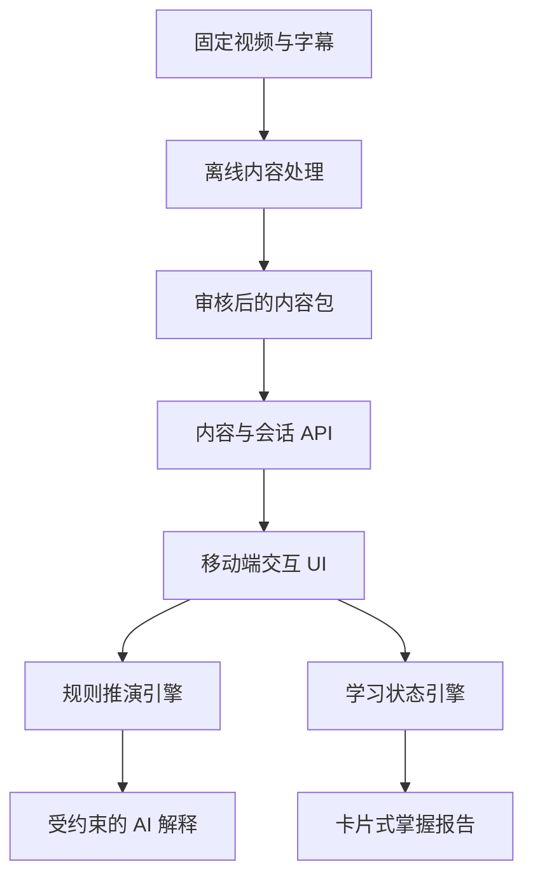
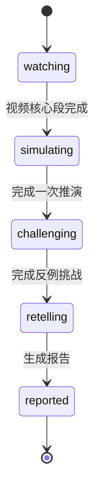
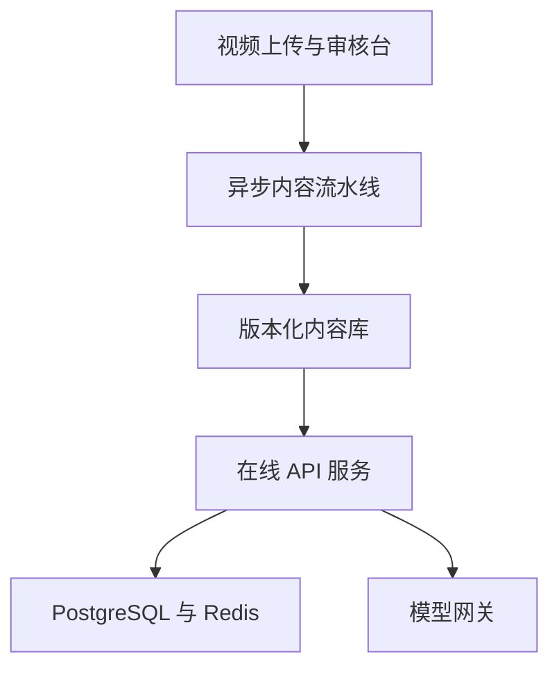

# 《财经推演室》后端实现说明 V1.0

> 适用范围：抖音精选“内容重构”黑客松原型，以及后续正式产品演进。  
> 首个固定视频：《美联储降息如何影响股票、黄金和汇率》。  
> 核心原则：不是替用户总结视频，而是让用户亲自运行一遍视频里的逻辑。

## 1. 后端要解决什么问题

《财经推演室》的后端不是普通的“上传视频—调用大模型—返回摘要”。它需要同时完成五件事：

1. 把财经视频解析为带时间戳、证据、条件和例外的结构化知识；
2. 在视频合适的时间点下发轻量 AI 帮练，不在开头集中展示全部功能；
3. 保存用户每次判断、推演和复述，识别认知误区；
4. 用可验证的规则推导资产方向，用大模型解释推导过程；
5. 将整段学习行为汇总为专业但不教科书化的卡片式掌握报告。

后端必须严格区分两条链路：

- **内容生产链路（离线）**：视频解析、知识抽取、题目生成、人工审核、版本发布；
- **用户体验链路（在线）**：播放触发、答题、规则推演、反馈、复述评价、报告生成。

这一区分是整个方案能否在黑客松期间稳定落地的关键。

## 2. MVP 边界

### 2.1 黑客松版本做什么

- 只支持一条固定视频；
- 预先准备并审核 5 个核心概念、2 条因果链、3 个预测暂停点；
- 六类 AI 帮练以内容配置形式嵌入视频，不要求每类都实时生成；
- 选择题均为二选一；
- 推演沙盘支持 4 个离散变量和 3 组预设情景；
- 推演结果不连接实时行情，不预测价格，不推荐投资；
- 用户复述可调用一次大模型进行结构化评价；
- 最终生成卡片式掌握报告；
- 模型不可用时，题目、规则反馈和基础报告仍可正常展示。

### 2.2 黑客松版本暂不做什么

- 不做任意视频上传后的全自动发布；
- 不做连续数值宏观经济模型；
- 不做实时股票、黄金、汇率行情接入；
- 不做个股、基金和交易建议；
- 不引入图数据库、微服务、Kafka 等重型基础设施；
- 不让大模型独立决定“股票涨/跌、黄金涨/跌”；
- 不在用户观看时实时分析整段视频。

## 3. 总体架构



### 3.1 推荐技术栈

黑客松优先使用：

| 模块 | 推荐方案 | 原因 |
|---|---|---|
| Web 后端 | Python 3.11 + FastAPI | AI、数据处理和接口可统一使用 Python，实现快 |
| 数据校验 | Pydantic | 确保模型输出、API 输入和内容配置符合 Schema |
| 数据库 | SQLite | 单机 Demo 无需部署独立数据库 |
| ORM | SQLAlchemy 2.x | 后续可平滑迁移 PostgreSQL |
| 视频处理 | FFmpeg | 抽音轨、关键帧、裁剪证据片段 |
| 语音转写 | Whisper 类 ASR 或已有字幕 | 支持句级/词级时间戳 |
| 大模型接入 | 独立 ModelGateway | 隔离供应商差异、超时、重试和 JSON 校验 |
| 缓存 | 进程内缓存 | 固定内容包可直接缓存；MVP 不必部署 Redis |
| 部署 | 单个 Docker 容器 | 环境一致，便于演示和交付 |

正式版可将 SQLite 换为 PostgreSQL，将进程内缓存换为 Redis，将耗时内容处理放入 Celery/RQ 等任务队列。MVP 不需要提前采用这些组件。

### 3.2 推荐代码目录

```text
backend/
├── app/
│   ├── main.py                 # FastAPI 启动入口
│   ├── api/                    # 路由层
│   │   ├── content.py
│   │   ├── sessions.py
│   │   ├── interactions.py
│   │   ├── simulation.py
│   │   └── reports.py
│   ├── domain/                 # 核心业务逻辑
│   │   ├── content_service.py
│   │   ├── trigger_service.py
│   │   ├── rule_engine.py
│   │   ├── mastery_engine.py
│   │   └── report_service.py
│   ├── model_gateway/          # 大模型调用、Prompt 和结构化解析
│   ├── repositories/           # 数据访问
│   ├── schemas/                # Pydantic 请求/响应模型
│   ├── db/                     # 表结构与迁移
│   └── observability/          # 日志、错误、延迟
├── content_packages/
│   └── fed_rate_cut_v1/        # 审核后的固定视频内容包
├── pipelines/                  # 离线视频解析脚本
├── tests/
├── Dockerfile
└── requirements.txt
```

## 4. 六类 AI 帮练如何由后端支持

所有帮练都统一存为 `learning_activity`，通过 `activity_type` 区分。前端不需要为每类帮练调用完全不同的内容接口。

| 帮练类型 | activity_type | 后端主要职责 | 是否实时调用模型 |
|---|---|---|---:|
| 名词预检 | `term_precheck` | 在术语首次出现前触发，返回二选一题和简短解释 | 否 |
| 概念辨析 | `concept_compare` | 返回两个相近概念及差异证据 | 否 |
| 关键节点推演 | `prediction` | 保存选择、识别误区、返回因果反馈 | 否 |
| 历史回看 | `history_check` | 返回历史情景二选一题和解释 | 否 |
| 数据小实验 | `data_experiment` | 接收滑块/离散变量，根据规则返回变化 | 否 |
| 立场对话 | `stance_dialogue` | 保存用户选择的立场路径，给出条件化反馈 | 可选 |

每个帮练配置至少包含：

- 触发时间 `trigger_ms`；
- 是否自动暂停 `pause_video`；
- 标题、问题和两个选项；
- 所属知识点 `concept_ids`；
- 对应视频证据 `evidence_ids`；
- 正确或更合理的选项；
- 每个选项映射的认知标签；
- 反馈文案；
- 跳回视频的时间戳；
- 内容版本。

示例：

```json
{
  "id": "act_prediction_02",
  "activity_type": "prediction",
  "trigger_ms": 286000,
  "pause_video": true,
  "question": "降息之后，美元资产的利率回报下降，下一步更可能发生什么？",
  "options": [
    {
      "id": "A",
      "text": "持有黄金的相对机会成本下降",
      "misconception_tag": null
    },
    {
      "id": "B",
      "text": "黄金开始产生利息收入",
      "misconception_tag": "confuse_opportunity_cost_with_yield"
    }
  ],
  "preferred_option_id": "A",
  "concept_ids": ["real_rate", "gold_opportunity_cost"],
  "evidence_ids": ["ev_018"],
  "review_timestamp_ms": 271000,
  "feedback_template_id": "fb_prediction_02",
  "content_version": 1
}
```

## 5. 离线内容生产链路

### 5.1 输入

- 原视频文件或已获授权的视频地址；
- 原字幕（若有）；
- 视频标题、作者、简介等元数据；
- 内容编辑设定的目标知识范围。

### 5.2 处理步骤

1. **媒体预处理**：FFmpeg 抽取音轨，每 5—10 秒或镜头切换处抽取关键帧；
2. **字幕生成与对齐**：有字幕则清洗；无字幕则 ASR 转写，保留时间戳；
3. **章节切分**：结合语义转折、字幕间隔和画面标题生成章节候选；
4. **知识抽取**：要求模型输出概念、观点、事实、推断、因果边、成立条件、例外、论据和证据时间戳；
5. **活动候选生成**：从关键知识点生成六类帮练候选，选择题固定两个选项；
6. **规则草案生成**：把视频中的因果关系转成受控规则草案；
7. **Schema 校验**：JSON 字段、枚举、引用关系、时间戳范围必须合法；
8. **人工审核**：财经正确性、证据一致性、题目趣味性、暂停频率、风险表达；
9. **发布内容包**：审核通过后生成不可变版本，例如 `fed_rate_cut_v1`。

### 5.3 人工审核为什么不可省略

首版的难点不是模型能否生成文字，而是：

- 因果是否把“可能”写成“必然”；
- 条件是否缺失；
- 证据时间戳是否真的支持结论；
- 两个选项是否存在歧义；
- 推演规则是否发生方向冲突；
- 内容是否容易被理解为投资建议。

因此，模型产出只能是 `draft`，只有人工审核后才能变为 `published`。黑客松阶段可直接用 JSON 文件完成审核，不必开发完整 CMS。

### 5.4 内容包结构

```text
fed_rate_cut_v1/
├── manifest.json
├── transcript.json
├── chapters.json
├── concepts.json
├── evidence.json
├── causal_graph.json
├── activities.json
├── simulation_rules.json
├── feedback_templates.json
└── report_copy.json
```

发布时校验：ID 不重复、引用对象存在、时间戳不超出视频时长、暂停点最小间隔达标、每道选择题恰好两个选项、所有资产结论均包含不确定性表达。

## 6. 核心数据模型

### 6.1 内容类表

| 表 | 关键字段 | 作用 |
|---|---|---|
| `videos` | id, title, duration_ms, status, version | 视频基础信息 |
| `transcript_segments` | video_id, start_ms, end_ms, text | 字幕与证据定位 |
| `concepts` | id, name, definition, first_seen_ms | 核心概念 |
| `evidence` | id, start_ms, end_ms, quote, source_type | 原视频依据 |
| `causal_nodes` | id, label, node_type | 因果图节点 |
| `causal_edges` | from_id, to_id, direction, conditions, blockers | 带条件的因果边 |
| `learning_activities` | type, trigger_ms, payload_json, version | 六类帮练配置 |
| `simulation_rules` | conditions_json, effects_json, priority, version | 沙盘规则 |

### 6.2 用户运行类表

| 表 | 关键字段 | 作用 |
|---|---|---|
| `learning_sessions` | id, user_id, video_id, content_version, status | 一次完整学习会话 |
| `interaction_events` | session_id, activity_id, event_type, payload_json, created_at | 用户选择和行为事件 |
| `mastery_states` | session_id, concept_id, state, evidence_count | 概念掌握状态 |
| `misconceptions` | session_id, tag, severity, source_event_id | 认知误区 |
| `simulation_runs` | session_id, inputs_json, result_json, rule_version | 每次推演 |
| `retell_attempts` | session_id, text, rubric_json, result_json | 主动复述及评价 |
| `reports` | session_id, report_json, generated_at | 卡片报告快照 |

### 6.3 为什么要保存版本号

同一个用户会话必须绑定：

- `content_version`：当时看到的题目和知识内容；
- `rule_version`：当时使用的推演逻辑；
- `prompt_version`：复述评价和解释所用 Prompt；
- `model_id`：具体模型；
- `report_version`：报告计算方式。

否则规则或 Prompt 更新后，无法解释为什么同样输入产生不同反馈。

## 7. 在线用户链路

### 7.1 开始会话

前端进入视频页后请求：

`POST /api/v1/sessions`

请求：

```json
{
  "video_id": "fed_rate_cut_001",
  "anonymous_id": "device_demo_01"
}
```

响应包括 `session_id`、内容版本、视频元数据、章节、全部触发点的轻量索引。详细题目可随初次响应一起下发，减少 Demo 中途网络失败。

### 7.2 播放触发

前端本地根据 `trigger_ms` 判断是否弹出帮练，无需每秒向后端上报播放时间。触发时上报一次：

`POST /api/v1/sessions/{session_id}/events`

事件包括 `activity_shown`、`activity_answered`、`activity_skipped`、`video_review_clicked` 等。

为了不打断观看兴趣：

- 同一视频最多设置 3 个强制暂停点；
- 两个强制暂停点之间建议至少间隔 90 秒；
- 其他帮练使用轻提示，用户点击后再展开；
- 已完成或主动跳过的活动不重复弹出；
- 拖动进度条跨过触发点时，只触发最近且优先级最高的一项。

### 7.3 回答反馈

`POST /api/v1/sessions/{session_id}/activities/{activity_id}/answer`

```json
{
  "option_id": "B",
  "response_time_ms": 4200,
  "video_position_ms": 286000
}
```

后端执行：

1. 校验活动属于当前内容版本；
2. 幂等保存回答；
3. 根据选项映射更新概念掌握和误区标签；
4. 返回“判断 + 原因 + 条件 + 视频证据”，而不是只有对错；
5. 如回答错误，附带可跳回的证据时间戳。

响应示例：

```json
{
  "judgement": "needs_review",
  "headline": "你把‘机会成本下降’理解成了‘黄金产生收益’",
  "explanation": "降息不会让黄金产生利息，而是可能降低持有不生息黄金的相对机会成本。",
  "condition_note": "最终价格还会受到实际利率、美元和避险情绪影响。",
  "evidence": {
    "start_ms": 271000,
    "end_ms": 298000
  },
  "mastery_update": {
    "concept_id": "gold_opportunity_cost",
    "state": "developing"
  }
}
```

## 8. 规则推演引擎

### 8.1 输入变量

MVP 使用离散枚举，避免伪装成精确经济预测：

```json
{
  "fed_rate": "down",
  "inflation": "down",
  "growth": "stable",
  "risk_aversion": "low",
  "horizon": "short_term"
}
```

推荐枚举：

- `fed_rate`: `up | down | unchanged`
- `inflation`: `high | low | up | down`
- `growth`: `strong | stable | weak | recession`
- `risk_aversion`: `high | low`
- `horizon`: `short_term | medium_term`

### 8.2 规则表达

每条规则包含条件、影响路径、目标资产、方向、强度、优先级、冲突说明和证据：

```json
{
  "id": "rule_gold_01",
  "when": [
    {"field": "fed_rate", "operator": "eq", "value": "down"}
  ],
  "path": [
    "美元生息资产回报可能下降",
    "持有黄金的相对机会成本可能下降"
  ],
  "effect": {
    "asset": "gold",
    "direction": "supportive",
    "weight": 2
  },
  "conditions": ["通胀下降速度没有显著快于名义利率"],
  "evidence_ids": ["ev_018"],
  "priority": 50,
  "rule_version": 1
}
```

### 8.3 计算方式

对每个目标资产执行：

1. 找出满足输入条件的全部规则；
2. 生成每条规则的因果路径；
3. 将 `supportive` 记为正向权重，`pressure` 记为负向权重；
4. 分别保留正向和负向贡献，不直接抹平冲突；
5. 若单一方向明显占优，输出“可能获得支撑”或“可能承压”；
6. 若双方接近，输出“方向存在冲突/不确定”；
7. 选择权重和优先级最高的规则作为可能主导变量；
8. 返回触发规则 ID，供审计和报告使用。

伪代码：

```python
def simulate(inputs, rules):
    matched = [r for r in rules if matches(r["when"], inputs)]
    results = {}
    for asset in ["stocks", "gold", "usd"]:
        asset_rules = [r for r in matched if r["effect"]["asset"] == asset]
        positive = sum(r["effect"]["weight"] for r in asset_rules
                       if r["effect"]["direction"] == "supportive")
        negative = sum(r["effect"]["weight"] for r in asset_rules
                       if r["effect"]["direction"] == "pressure")
        results[asset] = classify_direction(positive, negative, asset_rules)
    return results
```

### 8.4 情景 B 示例

输入：利率下降、经济快速恶化、避险情绪高。

- 股票：降息降低融资成本是正向路径，但衰退和盈利预期下降可能形成更强负向路径，因此结果为“仍可能承压”；
- 黄金：机会成本下降与避险需求同时构成支撑，但仍提示美元和实际利率等条件；
- 美元：利差路径可能承压，避险资金流入路径可能支撑，标记为“方向冲突”；
- 主导变量：经济衰退或避险情绪，而不是“降息”本身。

### 8.5 大模型在推演中的边界

规则引擎先生成：资产方向、触发规则、主导因素、冲突路径、条件和证据。大模型只能将这些结构化结果改写为自然语言，不得新增方向、事实或投资建议。

如果模型输出校验失败，直接使用本地模板：

> 在当前情景下，{asset} 受到 {positive_path} 的支撑，但同时受到 {negative_path} 的影响，因此方向存在冲突。当前更可能占主导的变量是 {dominant_factor}。这是一种条件化推演，不代表市场预测或投资建议。

## 9. 大模型调用设计

### 9.1 ModelGateway

所有模型调用只经过统一网关，业务层不直接依赖某一家模型 API。网关负责：

- 超时控制；
- 最多一次安全重试；
- JSON Schema 校验；
- Prompt 版本记录；
- 输入长度限制；
- 敏感信息过滤；
- 延迟、错误类型和模型 ID 记录；
- 失败后的固定模板降级。

### 9.2 需要实时调用模型的场景

黑客松版只建议保留两个：

1. 用户三句话主动复述的评价；
2. 用户对因果节点的自由追问（若 Demo 必须展示）。

选择题反馈、变量推演和基础报告均不依赖实时模型。

### 9.3 主动复述评价

用户复述后，后端先做长度和敏感内容校验，再将以下信息传给模型：

- 用户原文；
- 本视频审核后的关键因果点；
- 必须出现的条件词；
- 常见误区标签；
- 允许引用的证据；
- 固定评价量表。

模型必须返回：

```json
{
  "covered_concepts": ["rate", "financing_cost"],
  "missing_links": ["financing_cost_to_profit_expectation"],
  "misconceptions": ["treat_possible_as_certain"],
  "uncertainty_language": "weak",
  "transfer_level": "developing",
  "feedback": "你已经说清降息与融资成本的关系，但还缺少盈利预期这一环，并把可能上涨说成了必然上涨。"
}
```

后端再次校验标签只能来自允许枚举，引用只能来自给定证据。校验失败则返回规则化基础反馈，不阻塞报告生成。

## 10. 学习状态与认知误区

### 10.1 掌握状态

每个概念使用四态模型：

- `unseen`：尚未产生有效行为；
- `developing`：接触过但回答错误、跳过或复述遗漏；
- `understood`：至少一次正确判断并能解释相邻因果；
- `transfer_ready`：能在反例或新情景中正确使用该概念。

状态不是简单由“正确率”决定。建议采用证据累计：

- 二选一正确：+1；
- 能说明条件：+1；
- 反例挑战正确：+2；
- 主动复述覆盖：+2；
- 把“可能”说成“必然”：-1；
- 混淆相关与因果：-2；
- 仅重复结论但缺少路径：不加分。

### 10.2 认知误区标签

建议首版固定枚举：

- `treat_possible_as_certain`：把可能当必然；
- `ignore_preconditions`：忽略成立条件；
- `single_cause_bias`：用单一原因解释复杂结果；
- `confuse_correlation_causation`：混淆相关与因果；
- `confuse_nominal_real_rate`：混淆名义利率和实际利率；
- `confuse_opportunity_cost_with_yield`：混淆机会成本与资产生息；
- `ignore_expectations_pricing`：忽略市场预期已定价；
- `missing_causal_link`：因果链中间环节缺失。

## 11. 卡片式掌握报告

报告的核心不是给用户一个考试分数，而是回答三个问题：

1. 你能不能讲清视频中的逻辑；
2. 条件变化后，你能不能处理反例；
3. 遇到新事件时，你能不能迁移使用。

### 11.1 报告计算

报告服务聚合：

- 完成了哪些帮练；
- 每个概念的掌握状态；
- 命中的误区标签；
- 沙盘中是否识别冲突变量；
- 反例挑战结果；
- 主动复述覆盖与遗漏；
- 推荐回看的证据片段。

建议返回卡片数组，方便前端自由排版：

```json
{
  "report_id": "rpt_001",
  "report_version": 1,
  "headline": "你已经抓住降息的主线，但容易把‘利好’理解成‘一定上涨’",
  "cards": [
    {
      "type": "logic_mastery",
      "title": "你的逻辑主线",
      "status": "mostly_clear",
      "summary": "能说清利率—融资成本—股票估值，但遗漏盈利预期。"
    },
    {
      "type": "counterexample",
      "title": "遇到反例时",
      "status": "developing",
      "summary": "你识别了衰退风险，但还需要注意市场预期已提前定价。"
    },
    {
      "type": "rewatch",
      "title": "最值得回看的 27 秒",
      "start_ms": 271000,
      "end_ms": 298000,
      "reason": "这里解释了黄金机会成本，而不是黄金产生利息。"
    },
    {
      "type": "next_challenge",
      "title": "带走一个新问题",
      "summary": "如果降息已经被市场提前预期，宣布当天资产为什么仍可能下跌？"
    }
  ],
  "disclaimer": "本报告用于检验内容理解，不构成投资建议。"
}
```

报告文案优先采用审核过的模板与字段拼装。模型可以润色标题，但模型失败不能导致报告页空白。

## 12. API 清单

| 方法 | 路径 | 用途 |
|---|---|---|
| GET | `/api/v1/videos/{video_id}/experience` | 获取视频、章节、触发点和内容版本 |
| POST | `/api/v1/sessions` | 创建学习会话 |
| GET | `/api/v1/sessions/{id}` | 恢复会话状态 |
| POST | `/api/v1/sessions/{id}/events` | 上报展示、跳过、回看等事件 |
| POST | `/api/v1/sessions/{id}/activities/{activity_id}/answer` | 提交帮练回答 |
| POST | `/api/v1/sessions/{id}/simulations` | 执行一次变量推演 |
| POST | `/api/v1/sessions/{id}/retell` | 提交主动复述并评价 |
| POST | `/api/v1/sessions/{id}/questions` | 对节点自由追问，可选 |
| POST | `/api/v1/sessions/{id}/reports` | 生成或刷新报告 |
| GET | `/api/v1/sessions/{id}/report` | 获取报告快照 |

统一响应格式：

```json
{
  "request_id": "req_xxx",
  "data": {},
  "error": null
}
```

错误格式：

```json
{
  "request_id": "req_xxx",
  "data": null,
  "error": {
    "code": "MODEL_TIMEOUT",
    "message": "AI 解释暂时不可用，已返回基础反馈。",
    "retryable": true
  }
}
```

## 13. 状态机与幂等

学习会话状态建议为：



用户可以跳过非关键步骤，因此后端不应强制严格线性，只需记录 `completed_steps`。所有提交接口接受 `idempotency_key`，避免重复点击产生两次回答或两份报告。

## 14. 缓存、性能与稳定性

### 14.1 性能目标

| 请求 | P95 目标 |
|---|---:|
| 内容包读取 | 300 ms 内 |
| 二选一反馈 | 300 ms 内 |
| 规则推演 | 500 ms 内 |
| 报告聚合（不含模型） | 800 ms 内 |
| 主动复述评价 | 8 秒内，超时降级 |

### 14.2 缓存策略

- 发布后的内容包按 `video_id + version` 缓存在内存；
- 规则表启动时加载并校验；
- 相同沙盘输入可按 `content_version + rule_version + input_hash` 缓存结果；
- 报告按会话保存快照，只有新行为产生后才重新计算。

### 14.3 降级策略

| 故障 | 用户体验 |
|---|---|
| 模型超时 | 返回审核模板或规则化解释 |
| ASR 失败 | 内容生产阶段停止发布，不影响已发布视频 |
| 数据库暂时不可写 | 前端本地暂存事件，恢复后批量补传 |
| 报告润色失败 | 使用确定性报告模板 |
| 某活动配置错误 | 跳过该活动，视频继续播放 |
| 网络断开 | 已预加载的题目和规则仍可完成 Demo |

## 15. 安全、隐私与财经合规

- 匿名体验只保存随机设备 ID，不要求手机号；
- 不保存不必要的原始音频；若用户语音复述，转写成功后可删除临时音频；
- 日志不得记录完整身份信息和模型密钥；
- API 密钥只存在服务端环境变量；
- 用户自由输入需做长度、提示注入和敏感内容过滤；
- 模型上下文只提供审核后的本视频证据；
- 所有资产影响统一使用“可能、通常、在特定条件下”等审慎表达；
- 页面和 API 结果均附带“情景推演，不构成投资建议”；
- 不输出个股、基金、仓位和买卖时点；
- 证据不足时明确回答“视频中没有足够依据”，不得补造事实。

## 16. 日志与数据分析

### 16.1 技术日志

每次模型调用记录：

- `request_id`；
- `session_id` 的脱敏值；
- `model_id`；
- `prompt_version`；
- 输入/输出 token 数（若接口提供）；
- 是否通过 JSON 校验；
- 延迟；
- 错误类型；
- 是否使用降级结果。

不建议在普通日志中直接记录用户完整复述文本。

### 16.2 产品事件

核心埋点：

- 视频开始、完成、退出位置；
- 帮练曝光、回答、跳过、响应时长；
- 错误后是否点击回看片段；
- 沙盘变量调整次数、使用预设还是自定义；
- 是否识别冲突路径；
- 反例挑战完成率；
- 复述提交率；
- 报告查看、展开、保存或分享。

黑客松 Demo 最值得展示的指标不是 DAU，而是：帮练完成率、错误后回看率、能够识别“有条件成立”的用户比例，以及完成前后对同类情景的迁移表现。

## 17. 测试方案

### 17.1 单元测试

- 每条规则在边界输入下是否正确触发；
- 正负路径冲突是否保留；
- 同一请求重复提交是否幂等；
- 掌握状态升级与降级是否符合量表；
- 每种误区标签是否正确映射；
- 报告卡片是否在缺少复述时仍能生成。

### 17.2 内容质量测试

- 每个知识点是否至少绑定一条视频证据；
- 每个因果边是否包含条件或明确说明条件不适用；
- 所有二选一题是否仅有两个选项；
- 题目是否可从视频内容得到依据；
- 错误选项是否对应真实认知误区，而非故意荒谬；
- 暂停点是否过密；
- 是否存在确定性投资表达。

### 17.3 端到端验收

1. 用户进入固定视频，创建会话成功；
2. 第一个术语出现时弹出名词预检；
3. 视频中段触发二选一推演，回答后返回因果反馈；
4. 用户运行情景 B，股票、黄金、美元显示不同路径与冲突；
5. 用户完成反例挑战；
6. 用户提交三句话复述，即使模型超时也得到基础反馈；
7. 报告页显示逻辑主线、误区、回看片段和迁移问题；
8. 全流程不出现具体投资建议；
9. 断网或模型失败不阻塞主流程。

## 18. 部署方案

### 18.1 黑客松部署

最简单组合：

- 前端：静态 Web 或现有互动原型；
- 后端：单个 FastAPI Docker 容器；
- 数据：容器挂载 SQLite 文件；
- 媒体：演示视频和证据片段使用静态资源；
- 配置：环境变量保存模型地址和密钥；
- 健康检查：`GET /healthz`；
- 启动时自动校验内容包和规则表。

为了现场稳定，可在演示设备中预加载内容包和关键接口响应；真实接口仍保存用户行为并执行规则推演。

### 18.2 正式版演进



演进顺序建议：

1. SQLite 迁移 PostgreSQL；
2. 建立内容审核后台；
3. 离线流水线加入任务队列；
4. 支持更多固定审核视频；
5. 用真实用户数据优化触发点和误区识别；
6. 最后再考虑半自动发布和个性化内容推荐。

不建议一开始引入图数据库。当前因果图规模小，关系表和 JSON 足以支持查询、版本和审计。

## 19. 开发排期

按 1 名前端、1 名后端/AI 工程师、1 名产品/内容负责人的黑客松小组估算：

| 阶段 | 后端任务 | 预计时间 |
|---|---|---:|
| 第 1 阶段 | 固定内容包、SQLite 表、会话和内容接口 | 0.5 天 |
| 第 2 阶段 | 帮练回答、误区映射、规则推演 | 1 天 |
| 第 3 阶段 | 主动复述模型调用、Schema 校验和降级 | 0.5 天 |
| 第 4 阶段 | 报告聚合、埋点、错误处理 | 0.5 天 |
| 第 5 阶段 | 前后端联调、断网与模型故障演练 | 0.5 天 |

如果时间不足，砍功能顺序为：自由追问 → 立场对话实时生成 → 语音复述；不能砍掉规则推演、反例挑战、报告和模型失败降级，因为它们共同证明产品不是普通视频总结器。

## 20. 后端完成标准

满足以下条件即可认为黑客松后端完成：

- 一条固定视频可以返回完整、版本化的内容包；
- 三个关键暂停点能按时间触发，选择题均为二选一；
- 回答会更新概念掌握和误区标签；
- 四变量沙盘能稳定返回股票、黄金、美元的条件化路径；
- 情景 B 能展示正负路径冲突，而不是给出简单涨跌答案；
- 主动复述有结构化评价，模型失败时有降级结果；
- 报告能由真实用户行为生成卡片数组；
- 所有结论可追溯到规则版本和视频证据；
- 主流程在没有实时行情、模型偶发失败的情况下仍可完成；
- 输出不包含个股、基金或交易建议。

## 21. 最重要的技术结论

《财经推演室》的可靠后端应当是“审核内容包 + 规则引擎 + 学习状态 + 受约束模型”的组合：

- **审核内容包**保证财经知识和视频证据可靠；
- **规则引擎**保证同一变量组合得到稳定、可解释、可复现的推演；
- **学习状态**把分散的点击变成对掌握程度和认知误区的判断；
- **受约束模型**负责解释和评价语言，而不替代规则做财经预测。

这样既能在黑客松中以较低开发量做出可真实体验的作品，也保留了未来扩展到更多财经视频的技术路径。
